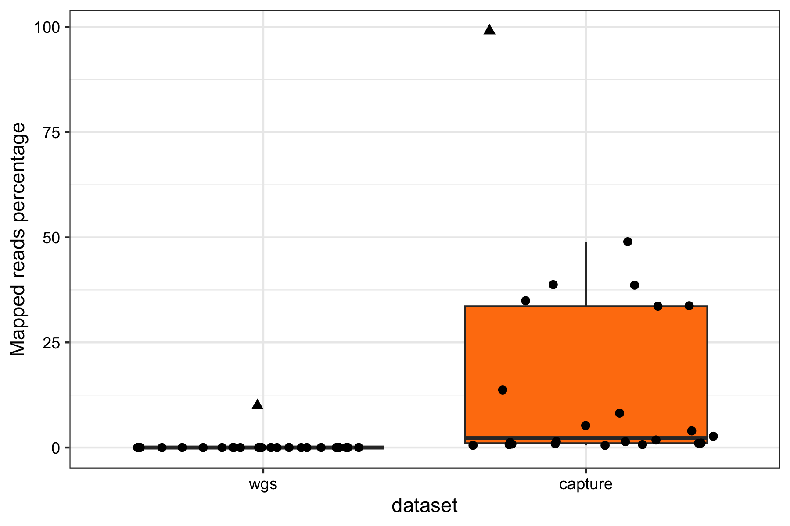
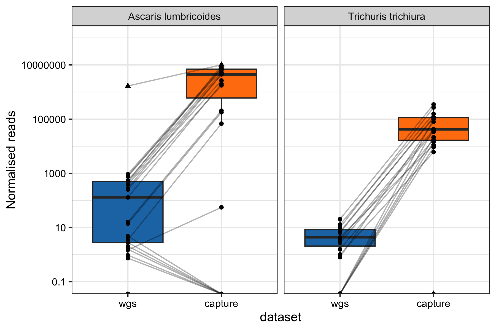
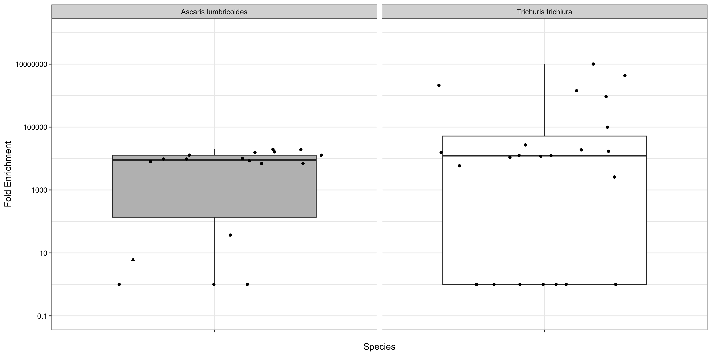
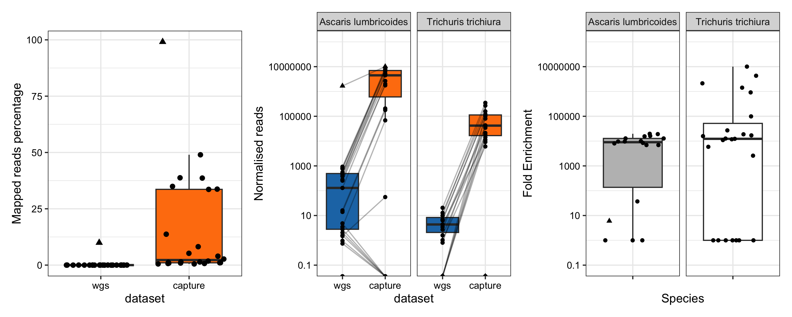

# On-target percentage WGS vs hybridisation capture, absolute and fold-enrichment

- Percentage of total reads mapped to the probes (no filters) 
- Absolute enrichment: counts of normalised reads (defined as reads mapped per million trimmed reads per Mb) and fold-enrichment 
- Fold-enrichment: calculated as the ratio of normalised reads yielded by hybridisation capture divided by that yielded by WGS

## Contents: 

- Bash code to get basic stats with flagstats from both hybrid capture and WGS mapped to probe/baits
- R code to create Figure 1 in manuscript/publication - link to follow when available 
- You need the sam files from mapping hybrid capture and WGS (separately) to the probe/bait fasta (PARASITE_BAIT_TARGETS_KRILL_FORMATTED.fasta) 

```bash
for i in *mapped_to_targets_only.sam; do   base_name=${i%%_trimmed*};   samtools flagstat "$i" > "${base_name}_flagstat.txt"; done

```
- Need to collate all the stats in a single txt file 

```bash
############################################################################################################
#COLLATE FLAGSTAT RESULTS
##############################################################
#!/bin/bash

# Directory containing samtools flagstat outputs
OUTPUT_DIR=.

# Create a file to store the results
RESULT_FILE="mapping_percentages.txt"
echo -e "Sample\tTotal_Reads_Mapped(%)" > $RESULT_FILE

# Loop through all flagstat output files
for file in "$OUTPUT_DIR"/*.txt; do
# Extract the sample name from the filename
sample_name=$(basename "$file" .txt)

# Use grep and awk to extract the percentage from the "mapped" line
mapped_percentage=$(grep "mapped (" "$file" | awk -F'[()%]' '{print $2}')

# Append the sample name and percentage to the results file
echo -e "${sample_name}\t${mapped_percentage}" >> $RESULT_FILE
done

# Print the results
cat $RESULT_FILE
#COLLATE_MAPPED_PERCENTAGE.sh (END)
#####################################################################################################################

```
### Code for on-target % plot
- Import them in R for plotting 
- This will create the plot with the percentage mapping of CAPTURE and WGS datasets to the TARGETS 

```{r, warning = FALSE,message = FALSE}
library(reshape2)
library(tidyverse)
library(patchwork)

###########################
#### CONTAMINATION PLOT ----
#############################

#import the files with the results from samtools flagstat
CAPTURE_MAPPED_READS <- read.table("/Users/marinapapaiakovou/Documents/00.Cambridge_PhD/02.Science/05.Hybridization_probe/05.CAPTURE_DATA/02_TRIMMED_DATA/07_CONTAMINATION_ASSESSMENT/CAPTURE_PARASITE_KRILL_mapping_percentages.txt", sep = "\t", header =T )
colnames(CAPTURE_MAPPED_READS) <- c('sample_id', 'reads_mapped_percentage')
CAPTURE_MAPPED_READS$dataset <- 'capture'

#remove last row
CAPTURE_MAPPED_READS <- CAPTURE_MAPPED_READS %>% filter(row_number() <= n()-1)


#isolate the numbers from the sample_ids
CAPTURE_MAPPED_READS_2 <- as.data.frame(sapply(strsplit(CAPTURE_MAPPED_READS$sample_id, "_"), function(x) x[2]))
colnames(CAPTURE_MAPPED_READS_2) <- 'sample_id'

#collate the datasets
CAPTURE_MAPPED_READS <- CAPTURE_MAPPED_READS %>%
  dplyr::select(2) #remove the previous sample_id
CAPTURE_MAPPED_READS_3 <- cbind(CAPTURE_MAPPED_READS_2,CAPTURE_MAPPED_READS )
CAPTURE_MAPPED_READS_3$dataset <- 'capture'


#SHOTGUN
SHOTGUN_MAPPED_READS <- read.table("/Users/marinapapaiakovou/Documents/00.Cambridge_PhD/02.Science/05.Hybridization_probe/06.SHOTGUN_DATA/02_TRIMMED_DATA/07_CONTAMINATION_ASSESSMENT/SHOTGUN_PARASITE_KRILL_mapping_percentages.txt", sep = "\t", header =T)
colnames(SHOTGUN_MAPPED_READS) <- c('sample_id', 'reads_mapped_percentage')
SHOTGUN_MAPPED_READS$dataset <- 'wgs'

#remove first row
SHOTGUN_MAPPED_READS = SHOTGUN_MAPPED_READS[-1,]


#isolate the numbers from the sample_ids
SHOTGUN_MAPPED_READS$sample_id <- as.character(SHOTGUN_MAPPED_READS$sample_id)

SHOTGUN_MAPPED_READS_2 <- as.data.frame(sapply(strsplit(SHOTGUN_MAPPED_READS$sample_id, "_"), function(x) x[2]))
colnames(SHOTGUN_MAPPED_READS_2) <- 'sample_id'

#collate the datasets
SHOTGUN_MAPPED_READS <- SHOTGUN_MAPPED_READS %>%
  dplyr::select(2) #remove the previous sample_id
SHOTGUN_MAPPED_READS_3 <- cbind(SHOTGUN_MAPPED_READS_2,SHOTGUN_MAPPED_READS )
SHOTGUN_MAPPED_READS_3$dataset <- 'wgs'


#COLLATE BOTH DATASETS 
ALL_MAPPED_READS <- rbind(CAPTURE_MAPPED_READS_3, SHOTGUN_MAPPED_READS_3)

#Create a species vector
species <- c("ascaris lumbricoides", "trichuris trichiura")

# Expand the data frame by duplicating the rows and adding species
ALL_MAPPED_READS_EXPANDED <- ALL_MAPPED_READS[rep(1:nrow(ALL_MAPPED_READS), each = length(species)), ]

# Add the 'species' column
ALL_MAPPED_READS_EXPANDED$species <- rep(species, times = nrow(ALL_MAPPED_READS))


#make the factors of dataset so you can print the wgs first 
ALL_MAPPED_READS$dataset <- factor(ALL_MAPPED_READS$dataset, levels = c("wgs", "capture"))

```
### On-target mapping figure, hybrid capture and WGS data 

```{r ON_TARGET_MAPPING_PLOT, fig.path='./00_FIGURES/', warning = FALSE,message = FALSE}

png(filename = "00_FIGURES/ON_TARGET_MAPPING_PLOT.png", height = 4, width = 6, units = "in", res = 300)
# Create the contamination plot to call it later
ON_TARGET_MAPPING <- ggplot(ALL_MAPPED_READS, aes(x = dataset, y = reads_mapped_percentage, fill = dataset)) +
  geom_boxplot(outlier.shape = NA) + #THIS WILL TURN OFF THE OUTLIARS THAT WERE COMING UP AS A POINT!!! 
 # geom_point()+
 # geom_jitter(aes(shape = ifelse(sample_id == "Ascaris", "worm", "faecal")), 
    #          width = 0.2, height = 0) + 
  geom_point(position = position_jitter(seed = 1), aes(shape = ifelse(sample_id == "Ascaris", "worm", "faecal")), 
             width = 0.2, height = 0, size = 2)+ #setting a seed = 1, or seed=42 makes the code reproducible. So you avoid generating plots with jitters that are in different spots on the x axis
  theme_bw() +
  labs(
   
    y = "Mapped reads percentage", shape = "shape"
  ) +
  scale_fill_manual(values = c("wgs" = "#1f77b4", "capture" = "#ff7f0e")) +
  theme(
    axis.text.x = element_text(color = "black"),  # Explicitly set x-axis text color to black
    axis.text.y = element_text(color = "black"),  legend.position = "none"  # Set y-axis text color to black (optional)
  )
# Custom colors for points

#call the plot when you need to see it when you knit the document 


#for the paper, to report the mean percentage etcf
summary_stats <- ALL_MAPPED_READS %>%
  filter(sample_id != "Ascaris") %>%  # Exclude Ascaris
  group_by(dataset) %>%
  summarise(
    mean_percentage = round(mean(reads_mapped_percentage, na.rm = TRUE), 2),
    sd_percentage = round(sd(reads_mapped_percentage, na.rm = TRUE), 2),
    min_value = round(min(reads_mapped_percentage, na.rm = TRUE), 2),
    max_value = round(max(reads_mapped_percentage, na.rm = TRUE), 2)
  ) %>%
  mutate(range = round(max_value - min_value, 2))

#just for Ascaris 
summary_stats_Ascaris <- ALL_MAPPED_READS %>%
  filter(sample_id == "Ascaris") %>%  # Exclude Ascaris
  group_by(dataset) %>%
  summarise(
    mean_percentage = mean(reads_mapped_percentage, na.rm = TRUE),
    sd_percentage = sd(reads_mapped_percentage, na.rm = TRUE),
    min_value = min(reads_mapped_percentage, na.rm = TRUE),
    max_value = max(reads_mapped_percentage, na.rm = TRUE)
  ) %>%
  mutate(range = max_value - min_value)

print(ON_TARGET_MAPPING)
dev.off()
```

### Code for absolute enrichment plot
- This will create the plot with normalised absolute read counts at WGS and CAPTURE, per species and will connect the same sample id by a grey line 

```{r, warning = FALSE,message = FALSE}

##########################################################################################
#### R CODE TO SHOW TARGET ENRICHMENT IN CAPTURE PROBE DATA COMPARED TO WGS DATA ----
##########################################################################################

####################
# CAPTURE DATA ----
####################

####################
#import reads from both datasets make sure the sample names correspond to the reads 
CAPTURE_STATS <-read.table("/Users/marinapapaiakovou/Documents/00.Cambridge_PhD/02.Science/05.Hybridization_probe/05.CAPTURE_DATA/02_TRIMMED_DATA/02_MITOGENOME_MAPPING/ALL_CAPTURE_SAMPLES_BEDTOOLS_MULTICOV.txt",
                           sep="\t", header=F)


# Read the column names from the text file (assuming one column name per line)
CAP_column_names <- readLines("/Users/marinapapaiakovou/Documents/00.Cambridge_PhD/02.Science/05.Hybridization_probe/05.CAPTURE_DATA/02_TRIMMED_DATA/01_RAW_READ_COUNTS/CAPTURE_FILENAMES.txt")


# Assign the column names to your existing dataset
colnames(CAPTURE_STATS) <- CAP_column_names

#drop echinoccocus/taenia/anisakis
CAPTURE_STATS <- CAPTURE_STATS %>%
  slice(-5, -6, -11) #dropping  taenia/echinococcus/anisakis


#replace the species names 
# Create a named vector with the full names as keys and simplified names as values
species_replacements <- c(
  'AP017684_Enterobius_vermicularis_mitochondrial_DNA_complete' = 'Enterobius vermicularis',
  'NC_002545_Schistosoma_mansoni_mitochondrion_complete_genome' = 'Schistosoma mansoni',
  'NC_003415_Ancylostoma_duodenale_mitochondrion_complete_genome' = 'Ancylostoma duodenale',
  'NC_003416_Necator_americanus_mitochondrion_complete_genome' = 'Necator americanus',
 # 'NC_004022_Taenia_solium_mitochondrion_complete_genome' = 'Taenia solium',
  # 'NC_007934_Anisakis_simplex_mitochondrion_complete_genome' = 'Anisakis simplex', # Uncomment if needed
  'NC_016198_Ascaris_lumbricoides_mitochondrion_complete_genome' = 'Ascaris lumbricoides',
  'NC_017750_Trichuris_trichiura_mitochondrion_complete_genome' = 'Trichuris trichiura',
  'NC_028624_Strongyloides_stercoralis_isolate_PV001_mitochondrion' = 'Strongyloides stercoralis',
  'NC_035142_Ancylostoma_ceylanicum_mitochondrion_complete_genome' = 'Ancylostoma ceylanicum'
  # 'NC_044548_Echinococcus_granulosus_mitochondrion_complete_genome' = 'Echinococcus granulosus' # Uncomment if needed
)

# Use the vector to replace values in one go
CAPTURE_STATS$species <- species_replacements[CAPTURE_STATS$species]

#transform the dataset 
CAPTURE_STATS_L <- pivot_longer(CAPTURE_STATS, names_to = "sample_id", values_to = "raw_read_counts", cols=4:27)

# load data containing the total number of sequencing reads per sample
CAPTURE_SAMPLES_reads_n <- read.table("/Users/marinapapaiakovou/Documents/00.Cambridge_PhD/02.Science/05.Hybridization_probe/05.CAPTURE_DATA/02_TRIMMED_DATA/01_RAW_READ_COUNTS/CAPTURE_DATA_RAW_READS.txt", header=T, sep="\t")

# merged the dataframes
CAPTURE_MITO_DATA <- full_join(CAPTURE_STATS_L, CAPTURE_SAMPLES_reads_n, by="sample_id")

#add here a column specifying the dataset
CAPTURE_MITO_DATA$dataset <- "capture"

#normalise the data
CAPTURE_MITO_DATA_NORM <- CAPTURE_MITO_DATA %>% mutate(normalised = (raw_read_counts) / (raw_reads_n / 1000000) / (mitogenome_size_bp / 1e6))
#RAW_READS_N are the TRIMMED READS


####################
# WGS DATA ----
####################

WGS_STATS <-read.table("/Users/marinapapaiakovou/Documents/00.Cambridge_PhD/02.Science/05.Hybridization_probe/06.SHOTGUN_DATA/02_TRIMMED_DATA/02_MITOGENOME_MAPPING/ALL_WGS_SAMPLES_BEDTOOLS_MULTICOV.txt",
                           sep="\t", header=F)


# Read the column names from the text file (assuming one column name per line)
WGS_column_names <- readLines("/Users/marinapapaiakovou/Documents/00.Cambridge_PhD/02.Science/05.Hybridization_probe/06.SHOTGUN_DATA/02_TRIMMED_DATA/01_RAW_READ_COUNTS/WGS_FILENAMES.txt")


# Assign the column names to your existing dataset
colnames(WGS_STATS) <- WGS_column_names

#drop echinoccocus/taenia/anisakis
WGS_STATS <- WGS_STATS %>%
  slice(-5, -6, -11) #dropping  taenia/echinococcus/anisakis


#replace the species names 
# Create a named vector with the full names as keys and simplified names as values
species_replacements <- c(
  'AP017684_Enterobius_vermicularis_mitochondrial_DNA_complete' = 'Enterobius vermicularis',
  'NC_002545_Schistosoma_mansoni_mitochondrion_complete_genome' = 'Schistosoma mansoni',
  'NC_003415_Ancylostoma_duodenale_mitochondrion_complete_genome' = 'Ancylostoma duodenale',
  'NC_003416_Necator_americanus_mitochondrion_complete_genome' = 'Necator americanus',
  # 'NC_004022_Taenia_solium_mitochondrion_complete_genome' = 'Taenia solium',
  # 'NC_007934_Anisakis_simplex_mitochondrion_complete_genome' = 'Anisakis simplex', # Uncomment if needed
  'NC_016198_Ascaris_lumbricoides_mitochondrion_complete_genome' = 'Ascaris lumbricoides',
  'NC_017750_Trichuris_trichiura_mitochondrion_complete_genome' = 'Trichuris trichiura',
  'NC_028624_Strongyloides_stercoralis_isolate_PV001_mitochondrion' = 'Strongyloides stercoralis',
  'NC_035142_Ancylostoma_ceylanicum_mitochondrion_complete_genome' = 'Ancylostoma ceylanicum'
  # 'NC_044548_Echinococcus_granulosus_mitochondrion_complete_genome' = 'Echinococcus granulosus' # Uncomment if needed
)

# Use the vector to replace values in one go
WGS_STATS$species <- species_replacements[WGS_STATS$species]

#transform the dataset 
WGS_STATS_L <- pivot_longer(WGS_STATS, names_to = "sample_id", values_to = "raw_read_counts", cols=4:27)

# load data containing the total number of sequencing reads per sample
WGS_SAMPLES_reads_n <- read.table("/Users/marinapapaiakovou/Documents/00.Cambridge_PhD/02.Science/05.Hybridization_probe/06.SHOTGUN_DATA/02_TRIMMED_DATA/01_RAW_READ_COUNTS/WGS_DATA_RAW_READS.txt", header=T, sep="\t")

# merged the dataframes
WGS_MITO_DATA <- full_join(WGS_STATS_L, WGS_SAMPLES_reads_n, by="sample_id")

#add here a column specifying the dataset
WGS_MITO_DATA$dataset <- "wgs"

#normalise the data
WGS_MITO_DATA_NORM <- WGS_MITO_DATA %>% mutate(normalised = (raw_read_counts) / (raw_reads_n / 1000000) / (mitogenome_size_bp / 1e6))
#RAW_READS_N are the TRIMMED READS

#######################
#join datasets by rows 
#######################
CAPTURE_AND_WGS_MITO_DATA <- rbind(CAPTURE_MITO_DATA_NORM, WGS_MITO_DATA_NORM)

#test boxplots for Trichuris and Ascaris 
CAPTURE_AND_WGS_MITO_DATA_ALUM_TT <- CAPTURE_AND_WGS_MITO_DATA %>%
  filter(species =="Trichuris trichiura" | species =="Ascaris lumbricoides")
 # filter(normalised >10) #do not filter

#i need to add another column called sample_name so I can match fold enrichment data
CAPTURE_AND_WGS_MITO_DATA_ALUM_TT2 <- CAPTURE_AND_WGS_MITO_DATA_ALUM_TT %>%
  mutate(sample_name = ifelse(str_detect(sample_id, "_"), 
                              str_extract(sample_id, "(?<=_)\\w+"), 
                              str_extract(sample_id, "\\w+")))

#flip the order of the datasets, to plot the wgs first 

# Assuming CAPTURE_AND_WGS_MITO_DATA_ALUM_TT is your dataset
CAPTURE_AND_WGS_MITO_DATA_ALUM_TT2 <- CAPTURE_AND_WGS_MITO_DATA_ALUM_TT2 %>%
  mutate(dataset = factor(dataset, levels = c("wgs", "capture")))  # Set the order of dataset

#REMOVE THE ASCARIS SAMPLE FROM THE TRICHURIS 

CAPTURE_AND_WGS_MITO_DATA_ALUM_TT2 <- CAPTURE_AND_WGS_MITO_DATA_ALUM_TT2 %>%
  filter(!(species == "Trichuris trichiura" & 
             sample_id == "Ascaris" & 
             dataset == "capture"))

```

### Absolute count enrichment figure, hybrid capture and WGS data 


```{r CAPTURE_WGS_NORMALISED_READS_PLOT, warning=FALSE, fig.path='./00_FIGURES/' }

png(filename = "00_FIGURES/CAPTURE_WGS_NORMALISED_READS_PLOT.png", height = 4, width = 6, units = "in", res = 300)

CAPTURE_WGS_NORMALISED_READS_PLOT <- ggplot(CAPTURE_AND_WGS_MITO_DATA_ALUM_TT2, aes(x = dataset, y = normalised, fill = dataset)) + 
  geom_boxplot(outlier.shape = NA) +
  geom_line(aes(group = sample_name), color = "black", alpha = 0.3) + 
  geom_point(aes(shape = ifelse(sample_name == "Ascaris", "worm", "faecal")), 
             width = 0.2, height = 0) + 
  # geom_point(size = 1) +  # Adds points
  facet_wrap(~species) +  # Facet by species
  #scale_y_log10() + 
  theme_bw()+
  scale_y_log10(limits = c(1, 1e8)) +
    scale_y_log10(limits = c(1e-1, 1e8),  # Set limits starting from a small positive value
                  breaks = c(1e-1, 10,  1000,  100000, 10000000),  # Custom breaks
                  labels = c("0.1",  "10",  "1000",  "100000",  "10000000")) +  # Custom labels
  labs(
    y = "Normalised reads", shape = "shape"
  ) +
 # theme(legend.position = "bottom")+
    theme(legend.position = "none",
      axis.text.x = element_text(color = "black"),  # tried to do arial but they were not loading propery on the PDF
      axis.text.y = element_text(color = "black"))+
  scale_fill_manual(values = c("wgs" = "#1f77b4", "capture" = "#ff7f0e"))  # Custom colors for points
  #ggtitle("Normalised coverage per species for capture \n and wgs data; no filter on normalised reads") 

  #call the plot if you want to see when you knit the document
 # CAPTURE_WGS_NORMALISED_READS


  #CALCULATING MEDIAN FOR THE PAPER, FOR EVERYTHING ELSE BUT ASCARIS
median_stats <- CAPTURE_AND_WGS_MITO_DATA_ALUM_TT2 %>%
  filter(sample_id !="SHOTGUN_Ascaris") %>%
  filter(sample_id !="CAP_Ascaris") %>%
  group_by(dataset, species) %>%
  summarise(
    median_normalised = median(normalised, na.rm = TRUE)
  )


#CALCULATING STATS FOR THE PAPER FOR ASCARIS
median_stats_Ascaris <- CAPTURE_AND_WGS_MITO_DATA_ALUM_TT2 %>%
  filter(sample_id == "SHOTGUN_Ascaris" | sample_id == "CAP_Ascaris") %>% 
   # filter(sample_id =="CAP_Ascaris") %>%
  group_by(dataset, species) %>%
  summarise(
    median_normalised = median(normalised, na.rm = TRUE)
  )

print(CAPTURE_WGS_NORMALISED_READS_PLOT)
dev.off()
  
```



### Code for fold-enrichment plot
- This will create the plot with fold-enrichment at WGS and CAPTURE, per species 

```{r, warning = FALSE,message = FALSE}
######################
## FOLD ENRICHMENT ----
######################

#I think I will add a very small value instead because I cannot divide by zero and I don't want to remove the 0s because that is the point here to show that probe

#take the CAPTURE_MITO_DATA_NORM and rename the normalised column
#take the WGS_MITO_DATA_NORM and rename the normalised column 


#for capture
FOLD_CAPTURE_MITO_DATA_NORM <- CAPTURE_MITO_DATA_NORM %>%
  filter (species =="Ascaris lumbricoides" | species == "Trichuris trichiura") %>%
  mutate(sample_name = str_replace(sample_id, "^CAP_", ""))%>%
#  filter(normalised >10) %>% 
  rename(normalised_capture = normalised)%>%
    mutate(normalised_capture = normalised_capture + 0.01) %>% #because I cannot divide by zero 
  select(-2, -4, -3, -5, -6, -7) #remove here start_pos, mitogenome_size_bp, sample_id, raw_read_counts, raw_reads_n, dataset)
#raw_reads_n = TRIMMED READS
#for wgs
FOLD_WGS_MITO_DATA_NORM <- WGS_MITO_DATA_NORM %>%
  filter (species =="Ascaris lumbricoides" | species == "Trichuris trichiura") %>%
  mutate(sample_name = str_replace(sample_id, "^SHOTGUN_", ""))%>%
 # filter(normalised >10) %>%
    rename(normalised_wgs = normalised)%>%
  mutate(normalised_wgs = normalised_wgs + 0.01) %>% #because I cannot divide by zero
  select(-2, -3, -4, -5, -6, -7) #remove here start_pos, mitogenome_size_bp, sample_id, raw_read_counts, raw_reads_n, dataset)


#merge the datasets by sample id and by species 
merged_data <- FOLD_CAPTURE_MITO_DATA_NORM %>%
  inner_join(FOLD_WGS_MITO_DATA_NORM, by = c("species", "sample_name"))

#calculate enrichment
merged_data <- merged_data %>%
  mutate(fold_enrichment = normalised_capture / normalised_wgs)


#i need to add another column called sample_name so I can match fold enrichment data
CAPTURE_AND_WGS_MITO_DATA_ALUM_TT3 <- CAPTURE_AND_WGS_MITO_DATA_ALUM_TT %>%
  mutate(sample_name = ifelse(str_detect(sample_id, "_"), 
                              str_extract(sample_id, "(?<=_)\\w+"), 
                              str_extract(sample_id, "\\w+")))%>%
  select(-2,-3,-4, -5, -6, -8)


#MERGE THEM ALL NOW 
CAPTURE_WGS_FOLD_ENRICHMENT <- inner_join(merged_data, CAPTURE_AND_WGS_MITO_DATA_ALUM_TT3, by = c("sample_name", "species"))

#keep one number for fold-enrichment per species per sample
UNIQUE_FOLD_ENRICHMENT <- CAPTURE_WGS_FOLD_ENRICHMENT %>%
  group_by(species, sample_name) %>%
  summarise(fold_enrichment = first(fold_enrichment), .groups = 'drop')

##add dataset to the dataset
UNIQUE_FOLD_ENRICHMENT$dataset <- 'capture'

#remove the 'Ascaris' from the Trichuris
#UNIQUE_FOLD_ENRICHMENT

UNIQUE_FOLD_ENRICHMENT2 <- UNIQUE_FOLD_ENRICHMENT %>%
  filter(!(species == "Trichuris trichiura" & 
             sample_name == "Ascaris" & 
             dataset == "capture"))
  
#write_csv(UNIQUE_FOLD_ENRICHMENT2, "/Users/marinapapaiakovou/Documents/00.Cambridge_PhD/02.Science/05.Hybridization_probe/08.ANALYSIS/UNIQUE_FOLD_ENRICHMENT2.csv")

```

### FOLD-enrichment figure, hybrid capture and WGS data 


```{r UNIQUE_FOLD_ENRICHMENT_ALUM_TT_PLOT, warning=FALSE, message=FALSE, fig.path='./00_FIGURES/'}

png(filename = "00_FIGURES/UNIQUE_FOLD_ENRICHMENT_ALUM_TT_PLOT.png", height = 6, width = 12, units = "in", res = 300) 
#PLOT 
UNIQUE_FOLD_ENRICHMENT_ALUM_TT_PLOT <- ggplot(UNIQUE_FOLD_ENRICHMENT2, aes(x = "", y = fold_enrichment, fill = species)) +
  geom_boxplot(outlier.shape = NA) +
 # geom_jitter(aes(shape = ifelse(sample_name == "Ascaris", "worm", "faecal")), 
     #         width = 0.2, height = 0) + 
  geom_point(position = position_jitter(seed = 1), aes(shape = ifelse(sample_name == "Ascaris", "worm", "faecal")), 
             width = 0.2, height = 0)+
   labs(
       x = "Species",
       y = "Fold Enrichment", shape = "shape") +
  facet_wrap(~ species) +  # Facet by species
  theme(axis.text.x = element_text(angle = 45, hjust = 1)) +
  scale_fill_manual(values = c("Ascaris lumbricoides" = "grey", "Trichuris trichiura" = "white")) + 
  scale_y_log10(limits = c(1e-1, 1e8),  # Set limits starting from a small positive value
                breaks = c(1e-1, 10,  1000,  100000, 10000000),  # Custom breaks
                labels = c("0.1",  "10",  "1000",  "100000",  "10000000")) +  # Custom labels
  theme_bw() +
  theme(legend.position = "none") +
  theme(
    axis.text.x = element_text(color = "black"),  # tried to do arial but they were not loading propery on the PDF
    axis.text.y = element_text(color = "black") 
  )

#call the plot here if you want
#UNIQUE_FOLD_ENRICHMENT_ALUM_TT_PLOT

median_stats_FOLD_ENRICHMENT <- UNIQUE_FOLD_ENRICHMENT %>%
  filter(sample_name !="Ascaris") %>%
  group_by( species) %>%
  summarise(
    median_fold_enrichment = median(fold_enrichment, na.rm = TRUE)
  )

#species              median_fold_enrichment
#1 Ascaris lumbricoides                  6931.
#2 Trichuris trichiura                  12347.


#ONLY FOR ASCARIS
median_stats_FOLD_ENRICHMENT_ONLY_ASCARIS <- UNIQUE_FOLD_ENRICHMENT %>%
  filter(sample_name=="Ascaris") %>%
  group_by( species) %>%
  summarise(
    median_fold_enrichment = median(fold_enrichment, na.rm = TRUE)
  )

print(UNIQUE_FOLD_ENRICHMENT_ALUM_TT_PLOT)
dev.off()

```



### Code for Figure 1 on paper - on-target % mapping, absolute enrichment and fold-enrichment
- Bring all the plots together now to form Figure 1 

``` {r FIG1_ON_TARGET_ENRICHMENT_FOLD_ENRICHMENT , fig.path = './00_FIGURES/', warning = FALSE,message = FALSE}

png(filename = "00_FIGURES/FIG1_ON_TARGET_ENRICHMENT_FOLD_ENRICHMENT.png", height =4, width = 10, units = "in", res = 300)

ON_TARGET_ENRICHMENT <- ON_TARGET_MAPPING | CAPTURE_WGS_NORMALISED_READS_PLOT |  UNIQUE_FOLD_ENRICHMENT_ALUM_TT_PLOT +
  plot_layout(ncol = 1, guides = "collect")

print(ON_TARGET_ENRICHMENT)


dev.off()
```


- Move the Figure to Illustrator and beautify further !
