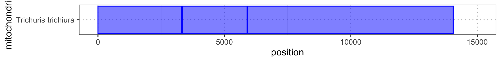
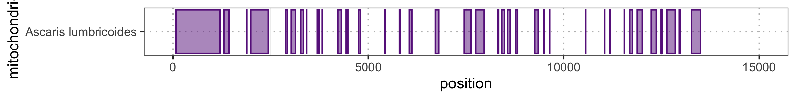
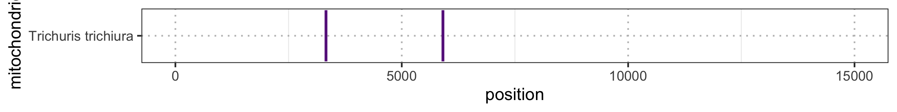

# Probe and gap coverage across the entir elength of mitochondrial genome of *Ascaris lumbricoides* and *Trichuris trichiura* 

- Mitochondrial gene order for both species
- Coordinates were the probes/baits bind
- Gaps were no probes were designed/hybridised 
- Normalised depth, where '1' means even coverage across all bases 

## Contents: 

- Bash code to calculate max depth per species  
- Bash code to get the correct(!) probe coordinates (especially for *Ascaris*, see below why) and the gap sequences
- R code to plot the gene order of the mitogenomes as blocks
- R code to transform the dataframes to get the coverage
- R code to plot the coordinates of the probes/baits
 -R code to plot the coverage on regions where the the probe/ baits bind
- R code to plot normalised depth across mitogenomes

### Calculate depth across all  bases, per species
```bash 

#samtools 1.6 # ## SAMTOOLS 1.6 (for depth etc) retains max depth 8000!!!! I needed to increase it
######################################################################################################
#!/bin/bash

# Define the two chromosome names you're interested in
CHROM1="NC_017750_Trichuris_trichiura_mitochondrion_complete_genome"
CHROM2="NC_016198_Ascaris_lumbricoides_mitochondrion_complete_genome"

# Directory to store the coverage results (you can change this as needed)
output_dir="./coverage_results"
mkdir -p "$output_dir"

# Loop through all the BAM files in the current directory
for bam_file in *.bam; do
# Extract the base name, keeping only the part up to '_trimmed'
base_name=$(basename "$bam_file" | sed 's/\(_trimmed\).*/\1/')

# Run samtools depth to calculate the coverage
coverage_file="${output_dir}/${base_name}_coverage"
samtools depth -d 1000000 "$bam_file" > "$coverage_file" ## SAMTOOLS 1.6 (for depth etc) retains max depth 8000!!!! I needed to increase it
#because I was getting very weird plataeu at 8000
# Split coverage based on the two chromosomes
trichuris_output="${output_dir}/${base_name}_Trichuris_coverage"
ascaris_output="${output_dir}/${base_name}_Ascaris_coverage"

awk -v chrom="$CHROM1" '$1 == chrom {print $0}' "$coverage_file" > "$trichuris_output"
awk -v chrom="$CHROM2" '$1 == chrom {print $0}' "$coverage_file" > "$ascaris_output"

# Print progress
echo "Processed $bam_file: Trichuris -> $trichuris_output, Ascaris -> $ascaris_output"
done

echo "All files processed!"

```

### Where do the probes bind 
- install minimap2 to map the probe sequences to the fasta with mtdna and nuclear genome

```bash 
conda activate minimap2
conda install bioconda::minimap2

#running minimap
#-sr for short reads 
#-a to export SAM
#had to replace the semicolons from the header 
#had to format the reference with fastaq to_fasta -l0 helmith_mtDNA_nuclear_combined.fasta helmith_mtDNA_nuclear_combined_FORMATTED.fasta
#minimap2 -a -x sr helmith_mtDNA_nuclear_combined.fasta cleaned_sequences.fas > BAIT_SEQUENCES_MAPPED.sam #used the below 
minimap2 -a -x sr helmith_mtDNA_nuclear_combined_FORMATTED.fasta cleaned_sequences.fas > TEST_BAIT_SEQUENCES_MAPPED.sam
#helmith_mtDNA_nuclear_combined_FORMATTED.fasta or this one but I figured that formatting does not change the mapping
#though in the past, BWA was having issues
samtools view -F 4 -h BAIT_SEQUENCES_MAPPED.sam > BAIT_SEQUENCES_ONLY_MAPPED.sam #remove unmapped sequences

#convert to bam
samtools view -S -b BAIT_SEQUENCES_ONLY_MAPPED.sam > BAIT_SEQUENCES_ONLY_MAPPED.bam

#create a nbed file from the bam 
#bedtools Version:   v2.30.0
bedtools bamtobed -i BAIT_SEQUENCES_ONLY_MAPPED.bam > BAIT_SEQUENCES_COORDINATES.bed #BUT THIS IS NOT THE FINAL - CHECK HOW I INCORPORATED THE NEW ASCARIS COORDINATES

#sort first
bedtools sort -i BAIT_SEQUENCES_COORDINATES.bed > BAIT_SEQUENCES_COORDINATES_SORTED.bed


````
- I had to do something extra, because the whole genome file of the Easton Ascaris paper contained mitochondrial reads... (either false assembly or NUMTs)
- Using this you will get the updated probe bed and gap file 

### Probe binding and gap co-ordinates
```bash 
#REMOVE THE OLD ASCARIS MITO COORDINATES FROM THE BED FILE  (BAIT_SEQUENCES_COORDINATES_SORTED.bed) THAT HAS COORDINATES FROM NUCLEAR ALUM/TT AND MITO TT
#
awk '$1 != "NC_016198_Ascaris_lumbricoides_mitochondrion_complete_genome"' BAIT_SEQUENCES_COORDINATES_SORTED.bed  > BAIT_SEQUENCES_COORDINATES_WITHOUT_ALUM_MITO.bed

#now I need to add the new ascaris coordinates to this new file BAIT_SEQUENCES_COORDINATES_WITHOUT_ALUM_MITO.bed
cat BAIT_SEQUENCES_ASCARIS_MT_ONLY_COORDINATES_SORTED.bed BAIT_SEQUENCES_COORDINATES_WITHOUT_ALUM_MITO.bed > BAIT_SEQ_IDs_COORDINATES_WITH_NEW_ALUM_MITO.bed

#ok, I have 1,144 sequences which is what I expect

#merged file for Ascaris mito 
BAIT_SEQUENCES_ASCARIS_MT_ONLY_COORDINATES_SORTED_MERGED.bed
#38 entries, before it was 44

#now make a merged file for all targets 
#sort
bedtools sort -i BAIT_SEQ_IDs_COORDINATES_WITH_NEW_ALUM_MITO.bed > BAIT_SEQ_IDs_COORDINATES_WITH_NEW_ALUM_MITO_SORTED.bed

#merge
bedtools merge -i BAIT_SEQ_IDs_COORDINATES_WITH_NEW_ALUM_MITO_SORTED.bed > BAIT_SEQ_IDs_COORDINATES_WITH_NEW_ALUM_MITO_SORTED_MERGED.bed


#now make a merged gappy bed file 
#before it had 43 entries
bedtools subtract -a Ascaris_mito.bed -b BAIT_SEQUENCES_ASCARIS_MT_ONLY_COORDINATES_SORTED_MERGED.bed > ALUM_NEW_PROBE_GAP_COORDINATES.bed
#now there are 37 gaps

```

### Protein and ribosome-coding gene plots for *Ascaris*


```{r ALUM_MITOGENE_COORDINATES_PLOT, warning= FALSE, message = FALSE, fig.path='./00_FIGURES/'}

png(filename = "00_FIGURES/ALUM_MITOGENE_COORDINATES_PLOT.png", height = 1, width = 8, units = "in", res = 300)

library(tidyverse)
##################################
#### ADD THE GENE COORDINATES ----
##################################
ALUM_MITOGENE_COORDINATES <- read.table("/Users/marinapapaiakovou/Documents/00.Cambridge_PhD/02.Science/05.Hybridization_probe/00.Targets/Ascaris_mitogene_coordinates.txt", sep = "\t", header = T) 
TT_MITOGENE_COORDINATES <- read.table("/Users/marinapapaiakovou/Documents/00.Cambridge_PhD/02.Science/05.Hybridization_probe/00.Targets/Trichuris_mitogene_coordinates.txt", sep = "\t", header = T) 


# Add a y-position for the rectangles (if necessary)
ALUM_MITOGENE_COORDINATES$ymin <- 0
ALUM_MITOGENE_COORDINATES$ymax <- 1

TT_MITOGENE_COORDINATES$ymin <- 0
TT_MITOGENE_COORDINATES$ymax <- 1


# Create the plot
ALUM_MITOGENE_COORDINATES_PLOT <- ggplot(ALUM_MITOGENE_COORDINATES) +
  geom_rect(aes(xmin = start, xmax = end, ymin = ymin, ymax = ymax), color = "lightgray", alpha = 0.4) +
  geom_text(aes(x = (start + end) / 2, y = (ymin + ymax) / 2, label = gene), size = 3, angle = 90, color = "black") +
  theme_bw() +
  scale_x_continuous(limits = c(0, 15000)) +
  labs( x = "Position", y = "") +
  theme(
    axis.text.y = element_blank(),
    axis.ticks.y = element_blank(),
    panel.grid = element_blank() # Turn off all grid lines
  )


print(ALUM_MITOGENE_COORDINATES_PLOT)
dev.off()
```


### Protein and ribosome-coding gene plots for *Trichuris*

```{r TT_MITOGENE_COORDINATES_PLOT, warning=FALSE, fig.path='./00_FIGURES/'}

png(filename = "00_FIGURES/TT_MITOGENE_COORDINATES_PLOT.png", height = 1, width = 8, units = "in", res = 300)

TT_MITOGENE_COORDINATES_PLOT <- ggplot(TT_MITOGENE_COORDINATES) +
  geom_rect(aes(xmin = start, xmax = end, ymin = ymin, ymax = ymax), color = "lightgray", alpha = 0.4) +
  geom_text(aes(x = (start + end) / 2, y = (ymin + ymax) / 2, label = gene), size = 3, angle = 90, color = "black") +
  theme_bw() +
  scale_x_continuous(limits = c(0, 15000)) +
  labs( x = "Position", y = "") +
  theme(
    axis.text.y = element_blank(),
    axis.ticks.y = element_blank(),
    panel.grid = element_blank() # Turn off all grid lines
  )


print(TT_MITOGENE_COORDINATES_PLOT)
dev.off()

```


### Code to transform the coverage dataframes
- For WGS and for capture data 

```{r, warning = FALSE}

#############
##### WGS ----
#############

Ascaris_capture_files <- list.files("/Users/marinapapaiakovou/Documents/00.Cambridge_PhD/02.Science/05.Hybridization_probe/05.CAPTURE_DATA/02_TRIMMED_DATA/05_MTDNA_DEPTH_COVERAGE/01_ALUM/", full.names = TRUE, pattern=".coverage")

Trichuris_capture_files <- list.files("/Users/marinapapaiakovou/Documents/00.Cambridge_PhD/02.Science/05.Hybridization_probe/05.CAPTURE_DATA/02_TRIMMED_DATA/05_MTDNA_DEPTH_COVERAGE/02_TT/",
full.names = TRUE, pattern=".coverage")

# Define a function to read a file, add 'sample_id' and 'species' columns
Ascaris_capture_read_and_add_columns <- function(file) {
  # Read the coverage file (assuming it has 3 columns: chrom, position, depth)
  df <- read.table(file, header = FALSE, col.names = c("chromosome", "position", "depth"))
  
  # Extract sample_id from the file name (before "_trimmed")
  sample_id <- sub(".*_(\\d+)_.*", "\\1", basename(file))
  
  # Add the 'sample_id' and 'species' columns
  df$sample_id <- sample_id
  df$species <- "Ascaris"
  df$dataset <- "capture"
  return(df)
}  
  # Use lapply to read all files and process them
Ascaris_capture_coverage_data <- lapply(Ascaris_capture_files, Ascaris_capture_read_and_add_columns)


# Combine all dataframes into one massive dataframe
Ascaris_capture_coverage_df <- do.call(rbind, Ascaris_capture_coverage_data)

##plot the coverage for CAPTURE data and Ascaris
#CAPTURE_ASCARIS_PLOT <- ggplot(Ascaris_capture_coverage_df, aes(x = position, y = depth, color = sample_id)) + 
#  geom_point() +
#  scale_color_viridis_d() + 
#  ggtitle("CAPTURE DATA - Ascaris mtDNA depth")+
#  facet_wrap(~ dataset, ncol=1)
# # facet_wrap(~ sample_id, ncol = 1, scales = "free_y")
##ggsave("XXXXX")

#Trichuris 
# Define a function to read a file, add 'sample_id' and 'species' columns
Trichuris_capture_read_and_add_columns <- function(file) {
  # Read the coverage file (assuming it has 3 columns: chrom, position, depth)
  df <- read.table(file, header = FALSE, col.names = c("chromosome", "position", "depth"))
  
  # Extract sample_id from the file name (before "_trimmed")
  sample_id <- sub(".*_(\\d+)_.*", "\\1", basename(file))
  
  # Add the 'sample_id' and 'species' columns
  df$sample_id <- sample_id
  df$species <- "Trichuris"
  df$dataset <- "capture"
  return(df)
  
}
# Use lapply to read all files and process them
Trichuris_capture_coverage_data <- lapply(Trichuris_capture_files, Trichuris_capture_read_and_add_columns)
  
# Combine all dataframes into one massive dataframe
Trichuris_capture_coverage_df <- do.call(rbind, Trichuris_capture_coverage_data)

#############
##### WGS ----
#############

Ascaris_wgs_files <- list.files("/Users/marinapapaiakovou/Documents/00.Cambridge_PhD/02.Science/05.Hybridization_probe/06.SHOTGUN_DATA/02_TRIMMED_DATA/05_MTDNA_DEPTH_COVERAGE/01_ALUM/", 
                                    full.names = TRUE, pattern=".coverage")
Trichuris_wgs_files <- list.files("/Users/marinapapaiakovou/Documents/00.Cambridge_PhD/02.Science/05.Hybridization_probe/06.SHOTGUN_DATA/02_TRIMMED_DATA/05_MTDNA_DEPTH_COVERAGE/02_TT/",
                                      full.names = TRUE, pattern=".coverage")


#Ascaris 
# Define a function to read a file, add 'sample_id' and 'species' columns
Ascaris_wgs_read_and_add_columns <- function(file) {
  # Read the coverage file (assuming it has 3 columns: chrom, position, depth)
  df <- read.table(file, header = FALSE, col.names = c("chromosome", "position", "depth"))
  
  # Modify the sub() function to extract the "18" from the filename
  sample_id <- sub(".*_(\\d+)_.*", "\\1", basename(file))
  
  # Add the 'sample_id' and 'species' columns
  df$sample_id <- sample_id
  df$species <- "Ascaris"
  df$dataset <- "wgs"
  return(df)
}  
# Use lapply to read all files and process them
Ascaris_wgs_coverage_data <- lapply(Ascaris_wgs_files, Ascaris_wgs_read_and_add_columns)


# Combine all dataframes into one massive dataframe
Ascaris_wgs_coverage_df <- do.call(rbind, Ascaris_wgs_coverage_data)

##plot the coverage for CAPTURE data and Ascaris
#SHOTGUN_ASCARIS_PLOT <- ggplot(Ascaris_wgs_coverage_df, aes(x = position, y = depth, color = sample_id)) + 
#  geom_point() +
#  scale_color_viridis_d() + 
#  ggtitle("SHOTGUN DATA - Ascaris mtDNA depth")+
#  facet_wrap(~ dataset, ncol=1)

#Trichuris 
#Trichuris 
# Define a function to read a file, add 'sample_id' and 'species' columns
Trichuris_wgs_read_and_add_columns <- function(file) {
  # Read the coverage file (assuming it has 3 columns: chrom, position, depth)
  df <- read.table(file, header = FALSE, col.names = c("chromosome", "position", "depth"))
  
  # Extract sample_id from the file name (before "_trimmed")
  sample_id <- sub(".*_(\\d+)_.*", "\\1", basename(file))
  
  # Add the 'sample_id' and 'species' columns
  df$sample_id <- sample_id
  df$species <- "Trichuris"
  df$dataset <- "wgs"
  return(df)
}  
# Use lapply to read all files and process them
Trichuris_wgs_coverage_data <- lapply(Trichuris_wgs_files, Trichuris_wgs_read_and_add_columns)


# Combine all dataframes into one massive dataframe
Trichuris_wgs_coverage_df <- do.call(rbind, Trichuris_wgs_coverage_data)


```


### Code to get the datasets with the probe coordinates for both species

```{r}
Probe_merged_coordinates <- read.table("/Users/marinapapaiakovou/Documents/00.Cambridge_PhD/02.Science/05.Hybridization_probe/00.Targets/BAIT_SEQ_IDs_COORDINATES_WITH_NEW_ALUM_MITO_SORTED_MERGED.bed", sep = "\t", header = F) 
                                    
colnames(Probe_merged_coordinates) <- c('target', 'start', 'end')

#filter for only mitogenomes
#Probe_merged_coordinates

#filter to include Ascaris only and mtDNA
Probe_merged_coordinates_filtered_mito_Ascaris <- Probe_merged_coordinates %>% filter(grepl('mitochondrion', target)) %>%
  filter(grepl('Ascaris', target))

#rename the species
Probe_merged_coordinates_filtered_mito_Ascaris$target[Probe_merged_coordinates_filtered_mito_Ascaris$target == 'NC_016198_Ascaris_lumbricoides_mitochondrion_complete_genome'] <- 'Ascaris lumbricoides'

#remove Ascaris from this Ascaris_capture_coverage_df
Ascaris_capture_coverage_df_NO_ASCARIS <- Ascaris_capture_coverage_df %>%
  filter(sample_id !="CAP_Ascaris_pos_NHM10_trimmed_Ascaris_coverage")

#filter only Trichuris
Probe_merged_coordinates_filtered_mito_Trichuris <- Probe_merged_coordinates %>% filter(grepl('mitochondrion', target)) %>%
  filter(grepl('Trichuris', target))

#rename the species
Probe_merged_coordinates_filtered_mito_Trichuris$target[Probe_merged_coordinates_filtered_mito_Trichuris$target == 'NC_017750_Trichuris_trichiura_mitochondrion_complete_genome'] <- 'Trichuris trichiura'

#also remove Ascaris from this Trichuris_capture_coverage_df
Trichuris_capture_coverage_df_NO_ASCARIS <- Trichuris_capture_coverage_df %>%
  filter(sample_id !="CAP_Ascaris_pos_NHM10_trimmed_Ascaris_coverage")


```

### Plot that shows where the probes bind for *Ascaris*


```{r MERGED_COORDINATES_ASCARIS, warning=FALSE, fig.path='./00_FIGURES/'}

png(filename = "00_FIGURES/MERGED_COORDINATES_ASCARIS.png", height = 1, width = 8, units = "in", res = 300)


#PLOTTING THE MERGED DATA
MERGED_COORDINATES_ASCARIS <- ggplot(Probe_merged_coordinates_filtered_mito_Ascaris) +
  geom_rect(aes(xmin = start, xmax = end, ymin = as.numeric(factor(target)) - 0.2, ymax = as.numeric(factor(target)) + 0.2), 
            fill = "blue", color = "blue", alpha = 0.5) +  # Rectangle ranges
  scale_y_continuous(breaks = as.numeric(factor(unique(Probe_merged_coordinates_filtered_mito_Ascaris$target))),
                     labels = unique(Probe_merged_coordinates_filtered_mito_Ascaris$target)) +
  scale_x_continuous(limits = c(0, 15000)) +
  labs(
       x = "position",
       y = "mitochondrion") +
  theme_bw() +
#  ggtitle("Probe bait coordinates for Ascaris mtDNA")+
  theme(panel.grid.major = element_line(color = "gray", linetype = "dotted"))


print(MERGED_COORDINATES_ASCARIS)
dev.off()
```


### Plot that shows where the probes bind for *Trichuris*

```{r MERGED_COORDINATES_TRICHURIS, warning=FALSE, fig.path='./00_FIGURES/', message=FALSE}

png(filename = "00_FIGURES/MERGED_COORDINATES_TRICHURIS.png", height = 1, width = 8, units = "in", res = 300)


MERGED_COORDINATES_TRICHURIS <- ggplot(Probe_merged_coordinates_filtered_mito_Trichuris) +
  geom_rect(aes(xmin = start, xmax = end, ymin = as.numeric(factor(target)) - 0.2, ymax = as.numeric(factor(target)) + 0.2), 
            fill = "blue", color = "blue", alpha = 0.5) +  # Rectangle ranges
  scale_y_continuous(breaks = as.numeric(factor(unique(Probe_merged_coordinates_filtered_mito_Trichuris$target))),
                     labels = unique(Probe_merged_coordinates_filtered_mito_Trichuris$target)) +
  scale_x_continuous(limits = c(0, 15000)) +
  labs(
       x = "position",
       y = "mitochondrion") +
 # ggtitle("Probe bait coordinates for Trichuris mtDNA")+
  theme_bw() +
  theme(panel.grid.major = element_line(color = "gray", linetype = "dotted"))

print(MERGED_COORDINATES_TRICHURIS)
dev.off()
```


### Plot that shows where the gaps are for *Ascaris* 

```{r PROBE_GAPS_ASCARIS, warning=FALSE, fig.path='./00_FIGURES/', message  = FALSE, warning=FALSE}

png(filename = "00_FIGURES/PROBE_GAPS_ASCARIS.png", height = 1, width = 8, units = "in", res = 300)

ALUM_PROBE_GAPS <- read.table("/Users/marinapapaiakovou/Documents/00.Cambridge_PhD/02.Science/05.Hybridization_probe/00.Targets/ALUM_NEW_PROBE_GAP_COORDINATES.bed", sep = "\t", header = F) 
colnames(ALUM_PROBE_GAPS) <- c('target', 'start', 'end')


#rename the species/target
ALUM_PROBE_GAPS$target[ALUM_PROBE_GAPS$target == 'NC_016198_Ascaris_lumbricoides_mitochondrion_complete_genome'] <- 'Ascaris lumbricoides'


PROBE_GAPS_ASCARIS <- ggplot(ALUM_PROBE_GAPS) +
  geom_rect(aes(xmin = start, xmax = end, ymin = as.numeric(factor(target)) - 0.2, ymax = as.numeric(factor(target)) + 0.2), 
            fill = "darkorchid4", color = "darkorchid4", alpha = 0.5) +  # Rectangle ranges
  scale_y_continuous(breaks = as.numeric(factor(unique(ALUM_PROBE_GAPS$target))),
                     labels = unique(ALUM_PROBE_GAPS$target)) +
  scale_x_continuous(limits = c(0, 15000)) +
  labs(
    x = "position",
    y = "mitochondrion") +
  theme_bw() +
 # ggtitle("Probe bait GAPS for Ascaris mtDNA")+
  theme(panel.grid.major = element_line(color = "gray", linetype = "dotted"))

print(PROBE_GAPS_ASCARIS)

dev.off()
```


### Plot that shows where the gaps are for *Trichuris*

```{r PROBE_GAPS_TRICHURIS, warning=FALSE, fig.path='./00_FIGURES/', message  = FALSE, warning=FALSE}

png(filename = "00_FIGURES/PROBE_GAPS_TRICHURIS.png", height = 1, width = 8, units = "in", res = 300)

TT_PROBE_GAPS <-read.table("/Users/marinapapaiakovou/Documents/00.Cambridge_PhD/02.Science/05.Hybridization_probe/00.Targets/TT_PROBE_GAP_COORDINATES.bed", sep = "\t", header = F) 
colnames(TT_PROBE_GAPS) <- c('target', 'start', 'end')

TT_PROBE_GAPS$target[TT_PROBE_GAPS$target == 'NC_017750_Trichuris_trichiura_mitochondrion_complete_genome'] <- 'Trichuris trichiura'


PROBE_GAPS_TRICHURIS <- ggplot(TT_PROBE_GAPS) +
  geom_rect(aes(xmin = start, xmax = end, ymin = as.numeric(factor(target)) - 0.2, ymax = as.numeric(factor(target)) + 0.2), 
            fill = "darkorchid4", color = "darkorchid4", alpha = 0.5) +  # Rectangle ranges
  scale_y_continuous(breaks = as.numeric(factor(unique(TT_PROBE_GAPS$target))),
                     labels = unique(TT_PROBE_GAPS$target)) +
  scale_x_continuous(limits = c(0, 15000)) +
  
   labs(
    x = "position",
    y = "mitochondrion") +
  theme_bw() +
#  ggtitle("Probe bait GAPS for Trichuris mtDNA")+
  theme(panel.grid.major = element_line(color = "gray", linetype = "dotted"))


print(PROBE_GAPS_TRICHURIS)
dev.off()
```


### Plots with normalised depth coverage for both species 

```{r, warning = FALSE}
#calculate median and then normalise the depth by the median per sample_id and remove the Ascaris because it causes bias in the plot
Trichuris_wgs_coverage_df_normalised <- Trichuris_wgs_coverage_df %>%
  group_by(sample_id, species) %>%
  mutate(median_depth = median(depth)) %>%
  ungroup() %>%
  mutate(normalised_depth = depth / median_depth)%>%
  filter(sample_id !="SHOTGUN_Ascaris_pos_NHM10_trimmed_Ascaris_coverage")

Ascaris_wgs_coverage_df_normalised <- Ascaris_wgs_coverage_df %>%
  group_by(sample_id, species) %>%
  mutate(median_depth = median(depth)) %>%
  ungroup() %>%
  mutate(normalised_depth = depth / median_depth)%>%
  filter(sample_id !="SHOTGUN_Ascaris_pos_NHM10_trimmed_Ascaris_coverage")

Trichuris_capture_coverage_df_normalised <- Trichuris_capture_coverage_df %>%
  group_by(sample_id, species) %>%
  mutate(median_depth = median(depth)) %>%
  ungroup() %>%
  mutate(normalised_depth = depth / median_depth)%>%
  filter(sample_id !="CAP_Ascaris_pos_NHM10_trimmed_Ascaris_coverage")

Ascaris_capture_coverage_df_normalised <- Ascaris_capture_coverage_df %>%
  group_by(sample_id, species) %>%
  mutate(median_depth = median(depth)) %>%
  ungroup() %>%
  mutate(normalised_depth = depth / median_depth) %>%
  filter(sample_id !="CAP_Ascaris_pos_NHM10_trimmed_Ascaris_coverage")

#PLOT THEM ALL
#I did not end up using the SHOTGUN ones but the code is here if needed
SHOTGUN_TRICHURIS_NORMALISED_PLOT <- ggplot(Trichuris_wgs_coverage_df_normalised, aes(x = position, y = normalised_depth, color = sample_id)) + 
  geom_point(alpha=0.1, size = 1) +
  scale_color_viridis_d() + 
  scale_x_continuous(limits = c(0, 15000)) +
  theme_bw() +
 # ggtitle("SHOTGUN DATA - Trichuris mtDNA NORMALISED depth - without Ascaris worm")+
  facet_wrap(~ dataset, ncol=1)

SHOTGUN_ASCARIS_NORMALISED_PLOT <- ggplot(Ascaris_wgs_coverage_df_normalised, aes(x = position, y = normalised_depth, color = sample_id)) + 
  geom_point(alpha=0.1,size = 1) +
  scale_x_continuous(limits = c(0, 15000)) +
  theme_bw() +
  scale_color_viridis_d() + 
 # ggtitle("SHOTGUN DATA -  Ascaris mtDNA NORMALISED depth - without Ascaris worm")+
  facet_wrap(~ dataset, ncol=1)

#will add the CAPTURE plots separately for visualisation
```
### Normalised depth plot for capture data - *Ascaris* 

```{r CAPTURE_ASCARIS_NORMALISED_PLOT, warning=FALSE, fig.path='./00_FIGURES/', message  = FALSE, warning=FALSE}

png(filename = "00_FIGURES/CAPTURE_ASCARIS_NORMALISED_PLOT.png", height = 3, width = 8, units = "in", res = 300)


CAPTURE_ASCARIS_NORMALISED_PLOT <- ggplot(Ascaris_capture_coverage_df_normalised, aes(x = position, y = normalised_depth, color = sample_id)) + 
  geom_line(alpha=0.4, size = 1) +
  scale_color_viridis_d() + 
  scale_x_continuous(limits = c(0, 15000)) +
  theme_bw() +
  theme(legend.position = "none") 
#  ggtitle("CAPTURE DATA - Ascaris mtDNA NORMALISED depth - without Ascaris worm")
 facet_wrap(~ dataset, ncol=1)

 #count how many sample ids unique you have here to add it to the caption of the figure
 length(unique(Ascaris_capture_coverage_df_normalised$sample_id))
 #14


print(CAPTURE_ASCARIS_NORMALISED_PLOT)
dev.off()
```


### Normalised depth plot for capture data - *Trichuris* 


```{r CAPTURE_TRICHURIS_NORMALISED_PLOT, warning=FALSE, fig.path='./00_FIGURES/', message  = FALSE, warning=FALSE}

png(filename = "00_FIGURES/CAPTURE_TRICHURIS_NORMALISED_PLOT.png", height = 3, width = 8, units = "in", res = 300)

CAPTURE_TRICHURIS_NORMALISED_PLOT <- ggplot(Trichuris_capture_coverage_df_normalised, aes(x = position, y = normalised_depth, color = sample_id)) + 
  geom_line(alpha=0.4, size = 1) +
  scale_color_viridis_d() + 
  scale_x_continuous(limits = c(0, 15000)) +
  theme_bw() +
  theme(legend.position = "none") 
  #facet_wrap(~ dataset, ncol=1)


print(CAPTURE_TRICHURIS_NORMALISED_PLOT)
dev.off()
```


### Combine all plots together (for faecal data only)
- gene co-ordinates, probe and gap co-ordinates and depth coverage for both species 


```{r GENE_COORDINATES_PROBES_GAPS_DEPTH_COVERAGE_PLOTS, warning=FALSE, fig.path='./00_FIGURES/', message  = FALSE, warning=FALSE}
library(patchwork)
png(filename = "00_FIGURES/GENE_COORDINATES_PROBES_GAPS_DEPTH_COVERAGE_PLOTS.png", height = 10, width = 12, units = "in", res = 300)


GENE_COORDINATES_PROBES_GAPS_DEPTH_COVERAGE_PLOTS <- 
  ALUM_MITOGENE_COORDINATES_PLOT+ MERGED_COORDINATES_ASCARIS + 
  PROBE_GAPS_ASCARIS + 
  CAPTURE_ASCARIS_NORMALISED_PLOT + TT_MITOGENE_COORDINATES_PLOT + MERGED_COORDINATES_TRICHURIS + 
  PROBE_GAPS_TRICHURIS + 
  CAPTURE_TRICHURIS_NORMALISED_PLOT +
  plot_layout(ncol = 1, heights = c(1, 1, 1, 3, 1, 1, 1, 3))


print(GENE_COORDINATES_PROBES_GAPS_DEPTH_COVERAGE_PLOTS)
dev.off()
```


- Beautify now on Illustrator !  

### Recreating the same structure of plots but only for the worm data (*Ascaris*)

```{r, warning= FALSE, message=FALSE}

Ascaris_capture_coverage_df_normalised_ONLY_ASCARIS_WORM <- Ascaris_capture_coverage_df %>%
  group_by(sample_id, species) %>%
  mutate(median_depth = median(depth)) %>%
  ungroup() %>%
  mutate(normalised_depth = depth / median_depth) %>%
  filter(sample_id =="CAP_Ascaris_pos_NHM10_trimmed_Ascaris_coverage")

Ascaris_wgs_coverage_df_normalised_ONLY_ASCARIS_WORM <- Ascaris_wgs_coverage_df %>%
  group_by(sample_id, species) %>%
  mutate(median_depth = median(depth)) %>%
  ungroup() %>%
  mutate(normalised_depth = depth / median_depth)%>%
  filter(sample_id =="SHOTGUN_Ascaris_pos_NHM10_trimmed_Ascaris_coverage")


#only plotting the Ascaris worm with the probe design baits and the probe gaps
CAPTURE_ONLY_ASCARIS_WORM_NORMALISED_PLOT <- ggplot(Ascaris_capture_coverage_df_normalised_ONLY_ASCARIS_WORM, aes(x = position, y = normalised_depth, color = sample_id)) + 
  geom_line( size = 1) +
  scale_color_viridis_d() + 
  scale_x_continuous(limits = c(0, 15000)) +
  theme_bw() +
  theme(legend.position = "none") +
  ggtitle("CAPTURE DATA - Ascaris mtDNA NORMALISED depth - ONLY Ascaris worm")
# facet_wrap(~ dataset, ncol=1)

WGS_ONLY_ASCARIS_WORM_NORMALISED_PLOT <- ggplot(Ascaris_wgs_coverage_df_normalised_ONLY_ASCARIS_WORM, aes(x = position, y = normalised_depth, color = sample_id)) + 
  geom_line(size = 1) +
  scale_color_viridis_d() + 
  scale_x_continuous(limits = c(0, 15000)) +
  theme_bw() +
  theme(legend.position = "none") +
  ggtitle("SHOTGUN DATA - Ascaris mtDNA NORMALISED depth - ONLY Ascaris worm")
# facet_wrap(~ dataset, ncol=1)


#MERGED_COORDINATES_ASCARIS + PROBE_GAPS_ASCARIS + CAPTURE_ONLY_ASCARIS_WORM_NORMALISED_PLOT + plot_layout(heights = c(1, 1, 2)) #makes the proportions better!!!! 
#ggsave("Figure_XX_CAPTURE_DATA_ONLY_ASCARIS_WORM_AND_MERGED_PROBE_COORDINATES_NORMALISED_DATA_PROBE_GAPS_TOO.pdf", width=300, height=300, units="mm") 

```

- Call all the plots together and save it as one 

```{r ASCARIS_WORM_ONLY_GENE_COORDINATES_PROBES_GAPS_DEPTH_COVERAGE_PLOTS, warning=FALSE, message= FALSE, fig.path='./00_FIGURES/'}

png(filename = "00_FIGURES/ASCARIS_WORM_ONLY_GENE_COORDINATES_PROBES_GAPS_DEPTH_COVERAGE_PLOTS.png", height = 10, width = 12, units = "in", res = 300)

ASCARIS_WORM_ONLY_GENE_COORDINATES_PROBES_GAPS_DEPTH_COVERAGE_PLOTS <- ALUM_MITOGENE_COORDINATES_PLOT + MERGED_COORDINATES_ASCARIS + PROBE_GAPS_ASCARIS + CAPTURE_ONLY_ASCARIS_WORM_NORMALISED_PLOT +WGS_ONLY_ASCARIS_WORM_NORMALISED_PLOT +   plot_layout(ncol = 1, heights = c(1, 1, 1, 3,3))

print(ASCARIS_WORM_ONLY_GENE_COORDINATES_PROBES_GAPS_DEPTH_COVERAGE_PLOTS)
dev.off()
```

- Beautify on illustrator!
