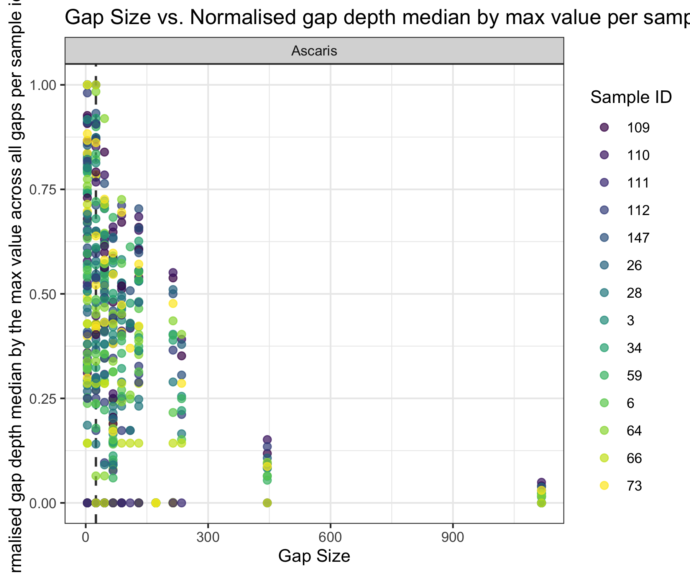

# Max coverage  achievedwith max gap (no probe designed for that region)
*Ascaris lumbricoides* and *Trichuris trichiura* 

- Purpose to figure out how much gap can be tolerated, whilst still having maximum depth, when you do not have probes for that area
- There is always going to be a distribution of fragments (smaller, and larger) so achieving high coverage in gaps is possible 
- The below analysis was only conducted for Ascaris, as *Trichuris* did not really have any gaps in the design


## Contents: 

- Bash code to calculate max depth in the gap coordinates
- R code to transform the datasets
- R code to plot the max normalised depth in relation to max gap

### Calculate depth at the gap coordinates of *Ascaris* 

```bash
#SCRIPT TO CALCULATE DEPTH FOR THE ALUM BED (which includes all the gaps that I did not have probes for)
#!/bin/bash

# Define the BED file to use for all BAM files
bed_file="ALUM_NEW_PROBE_GAP_COORDINATES.bed"  # Change this to the actual name of your single BED file

# Check if the BED file exists
if [[ ! -f "$bed_file" ]]; then
echo "BED file $bed_file not found. Please make sure it is in the directory."
exit 1
fi

# Loop through all BAM files that match the pattern
for bam_file in *trimmed_sorted_dup_filtered_CIGAR_final_nosambamba_nosamclip.bam; do
# Extract the sample name prefix (everything before "_trimmed")
sample_name="${bam_file%%_trimmed*}"

# Define the output file name
output_file="${sample_name}_probe_gap_coverage_ALUM.txt"

# Calculate depth using samtools depth, specifying the BED file and output file
samtools depth -d 1000000 -a -b "$bed_file" "$bam_file" > "$output_file"

echo "Coverage calculated for $bam_file, output saved to $output_file."
done
#ALUM_CALCULATE_GAP_DEPTH.sh (END)

```

### Transform the gap depth datasets and merge with gap sizes 
- if you have files with 0 size (with no coverage) this script won't like it, so delete those from your folder
```{r, warning = FALSE, message=FALSE}
library(tidyverse)

#REMEMBER TO DELETE THE FILES WITH ZERO SIZE
Ascaris_capture_files_probe_gaps <- list.files("/Users/marinapapaiakovou/Documents/00.Cambridge_PhD/02.Science/05.Hybridization_probe/05.CAPTURE_DATA/02_TRIMMED_DATA/05_MTDNA_DEPTH_PROBE_GAP_COVERAGE/01_ALUM/", 
                                               full.names = TRUE, pattern=".coverage")
#Trichuris_capture_files_probe_gaps <- list.files("/Users/marinapapaiakovou/Documents/00.Cambridge_PhD/02.Science/05.Hybridization_probe/05.CAPTURE_DATA/02_TRIMMED_DATA/05_MTDNA_DEPTH_PROBE_GAP_COVERAGE/02_TT/",
#                                                 full.names = TRUE, pattern=".coverage")
#
# Define a function to read a file, add 'sample_id' and 'species' columns
Ascaris_capture_read_and_add_columns <- function(file) {
  # Read the coverage file (assuming it has 3 columns: chrom, position, depth)
  df <- read.table(file, header = FALSE, col.names = c("chromosome", "position", "depth"))
  
  # Extract sample_id from the file name (before "_trimmed")
  sample_id <- sub(".*_(\\d+)_.*", "\\1", basename(file))
  
  # Add the 'sample_id' and 'species' columns
  df$sample_id <- sample_id
  df$species <- "Ascaris"
  df$dataset <- "capture"
  return(df)
}  
# Use lapply to read all files and process them
Ascaris_capture_coverage_data_probe_gaps <- lapply(Ascaris_capture_files_probe_gaps, Ascaris_capture_read_and_add_columns)

# Combine all dataframes into one massive dataframe
Ascaris_capture_coverage_data_probe_gaps_df <- do.call(rbind, Ascaris_capture_coverage_data_probe_gaps)

#Import the bed file with the gaps for each species 

ALUM_PROBE_GAPS <- read.table("/Users/marinapapaiakovou/Documents/00.Cambridge_PhD/02.Science/05.Hybridization_probe/00.Targets/ALUM_NEW_PROBE_GAP_COORDINATES.bed")
colnames(ALUM_PROBE_GAPS) <- c('chromosome', "gap_start", "gap_end")

#TT_PROBE_GAPS <- read.table("/Users/marinapapaiakovou/Documents/00.Cambridge_PhD/02.Science/05.Hybridization_probe/00.Targets/TT_PROBE_GAP_COORDINATES.bed")
#colnames(TT_PROBE_GAPS) <- c('chromosome', "gap_start", "gap_end")
#
#name the gaps so it's easier to group them later
ALUM_PROBE_GAPS <- ALUM_PROBE_GAPS %>%
  mutate(gap = paste0("gap_", row_number()))

# Initialize a new column for gaps
Ascaris_capture_coverage_data_probe_gaps_df$gap <- NA
#Trichuris_capture_coverage_probe_gaps_df$gap <- NA

#Ascaris
# Loop through each gap and assign gap labels
for (i in 1:nrow(ALUM_PROBE_GAPS)) {
  gap_start <- ALUM_PROBE_GAPS$gap_start[i]
  gap_end <- ALUM_PROBE_GAPS$gap_end[i]
  gap_label <- paste0("gap_", i)  # Create a gap label (e.g., "gap_1", "gap_2", etc.)
  
  # Update the gap column based on the position
  Ascaris_capture_coverage_data_probe_gaps_df$gap[Ascaris_capture_coverage_data_probe_gaps_df$position >= gap_start & 
                                                    Ascaris_capture_coverage_data_probe_gaps_df$position <= gap_end] <- gap_label
}

#Now will take a median of the single base depth per gap region 
Ascaris_capture_coverage_data_probe_gaps_df_gap_cov_median <- Ascaris_capture_coverage_data_probe_gaps_df %>%
  group_by(gap, sample_id) %>%
  mutate(gap_depth_median = median(depth))

# Remove duplicates and keep only the relevant columns
Ascaris_capture_coverage_data_probe_gaps_df_gap_cov_median_clean <- Ascaris_capture_coverage_data_probe_gaps_df_gap_cov_median %>%
  dplyr::select(sample_id, species, chromosome, gap, gap_depth_median) %>%
  distinct()

#Now joint the bed file with the coords and the gap_depth_median
ALUM_GAP_MEDIAN_DEPTH_GAP_SIZE_JOINT <- left_join(ALUM_PROBE_GAPS, Ascaris_capture_coverage_data_probe_gaps_df_gap_cov_median_clean, by= c('chromosome', 'gap'))
#create a new column that has a number for 'size' 

ALUM_GAP_MEDIAN_DEPTH_GAP_SIZE_JOINT_2 <- ALUM_GAP_MEDIAN_DEPTH_GAP_SIZE_JOINT%>%
  mutate(gap_size = gap_end-gap_start)

#remove the ascaris sample
ALUM_GAP_MEDIAN_DEPTH_GAP_SIZE_JOINT_2 <- ALUM_GAP_MEDIAN_DEPTH_GAP_SIZE_JOINT_2 %>%
filter(sample_id !="CAP_Ascaris_pos_NHM10_probe_gap_coverage_ALUM.txt")


# Calculate the maximum gap_depth_median per sample_id and normalize
ALUM_GAP_MEDIAN_DEPTH_GAP_SIZE_JOINT_2_normalized_data <- ALUM_GAP_MEDIAN_DEPTH_GAP_SIZE_JOINT_2 %>%
  group_by(sample_id) %>%
  mutate(max_gap_depth_median = max(gap_depth_median, na.rm = TRUE),  # Calculate max per sample_id
         normalized_gap_depth_median = gap_depth_median / max_gap_depth_median) %>%  # Normalize
  ungroup()  # Ungroup to return to a regular data frame


#find the max gap size for which normalised depth = 1
result <- ALUM_GAP_MEDIAN_DEPTH_GAP_SIZE_JOINT_2_normalized_data %>%
  filter(normalized_gap_depth_median ==1) %>%
  summarise(max_gap_size = max(gap_size))

```

### Relationship between gap size (between probes/baits) and normalised gap depth

```{r MAX_NORMALISED_DEPTH_GAP_SIZE_PLOT, warning=FALSE,message= FALSE, fig.path='./00_FIGURES/'}

png(filename = "00_FIGURES/MAX_NORMALISED_DEPTH_GAP_SIZE_PLOT.png", height = 5, width = 6, units = "in", res = 300)

MAX_NORMALISED_DEPTH_GAP_SIZE_PLOT <- ggplot(ALUM_GAP_MEDIAN_DEPTH_GAP_SIZE_JOINT_2_normalized_data, aes(x = gap_size, y = normalized_gap_depth_median, color = as.factor(sample_id))) +
  geom_vline(xintercept = 25, linetype = "dashed", color = "black", size = 0.7, alpha = 0.8) + #max gap size for which median is 1 
  geom_point(size = 2, alpha = 0.7) +
  #geom_smooth()+
 # geom_line() + # Use points to represent the data
  labs(title = "Gap Size vs. Normalised gap depth median by max value per sample id - ASCARIS",
       x = "Gap Size",
       y = "Normalised gap depth median by the max value across all gaps per sample id",
       color = "Sample ID") +
  scale_color_viridis_d() + 
  theme_bw() +
  facet_wrap(~species)+
  theme(legend.position = "right") 


print(MAX_NORMALISED_DEPTH_GAP_SIZE_PLOT)
dev.off()
```


- Beautify and annotate on Illustrator! 
- annotate that the number is '25 bp' of max gap to be tolerated

