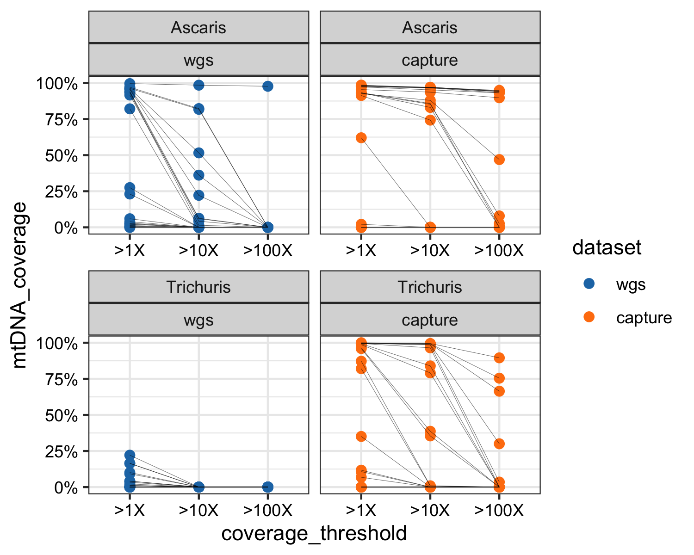
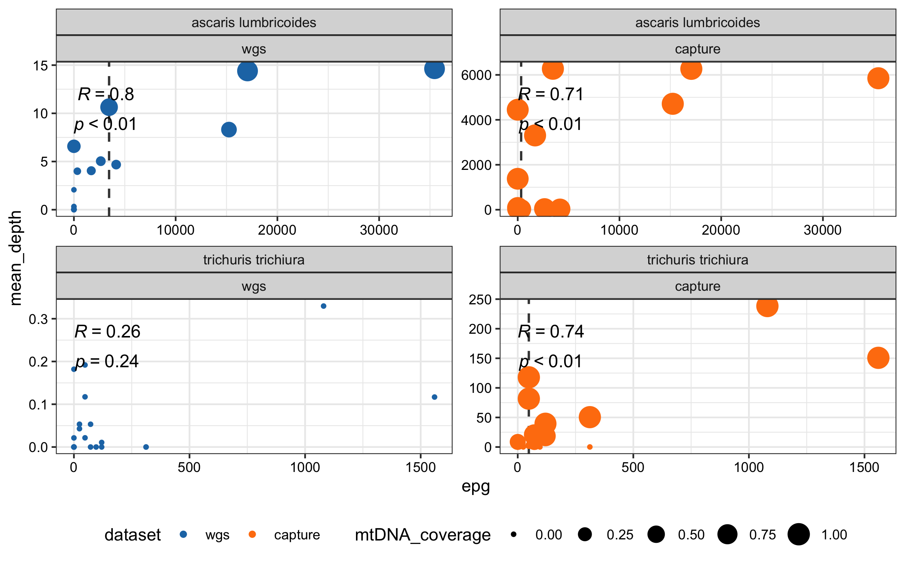
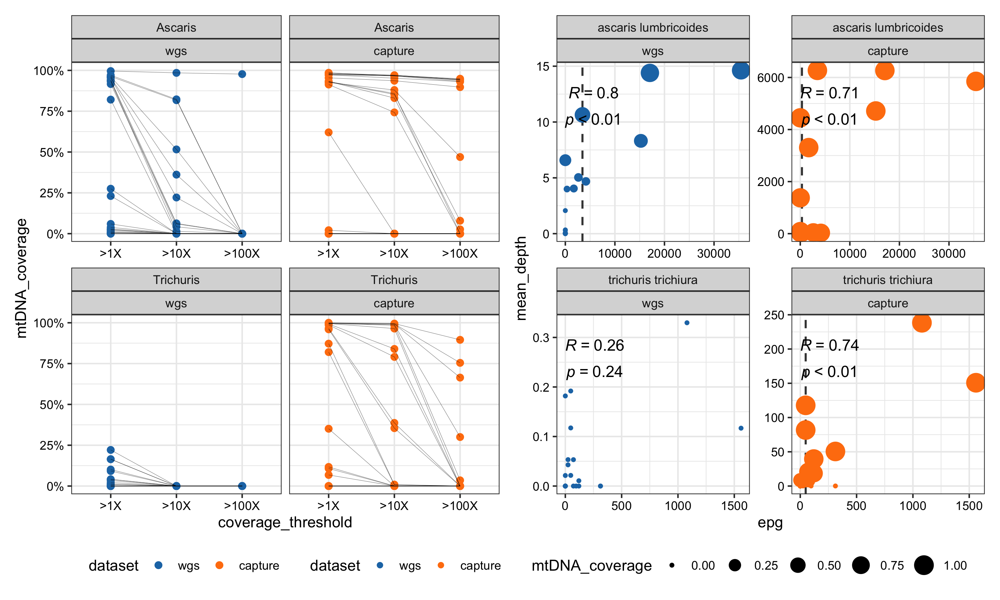

#  Comparison of mitochondrial coverage at >1x, >10 and >100x and relationship to parasite eggs per gram (EPG) in faecal samples for *Ascaris lumbricoides* and *Trichuris trichiura* 

- Assessing the mitochondrial genome completeness at different depth thresholds 
- Linking EPG (eggs per gram) to depth and running correlations 
- Plotting both (Figure 3 of BioRxiV MS)


# Contents 

- Bash script to calculate coverage per sample at different depth thresholds 
- R script to collate mitogenome % at different depth thresholds 
- R code to plot the thresholds 
- R code to plot relationship between epg and depth
- R code to combine the plots (Figure 3 of BioRxiv MS)

- Calculate coverage at different depths 
```bash 
#!/bin/bash

# Create the output file with headers
echo -e "sample_id\tmean_depth\tproportion_1x\tproportion_10x\tproportion_100x\tchrom" > collated_depth_results.tsv

# Loop through each BAM file
for bam in *.bam; do
sample=$(basename "$bam" .bam)

# Create a depth file for each sample
samtools depth -a "$bam" > "${sample}_depth.txt"

# Loop over chromosomes
for chrom in NC_016198_Ascaris_lumbricoides_mitochondrion_complete_genome NC_017750_Trichuris_trichiura_mitochondrion_complete_genome; do
if [[ $chrom == "NC_016198_Ascaris_lumbricoides_mitochondrion_complete_genome" ]]; then
species="Ascaris"
else
  species="Trichuris"
fi

# Calculate mean depth for the specific chromosome
mean_depth=$(awk -v chr="$chrom" '$1 == chr { sum += $3; count++ } END { print (count > 0 ? sum/count : 0) }' "${sample}_depth.txt")

# Calculate proportions for the specific chromosome
proportion_1x=$(awk -v chr="$chrom" '$1 == chr { total++; if ($3 >= 1) count++ } END { print (total > 0 ? count/total : 0) }' "${sample}_depth.txt")
proportion_10x=$(awk -v chr="$chrom" '$1 == chr { total++; if ($3 >= 10) count++ } END { print (total > 0 ? count/total : 0) }' "${sample}_depth.txt")
proportion_100x=$(awk -v chr="$chrom" '$1 == chr { total++; if ($3 >= 100) count++ } END { print (total > 0 ? count/total : 0) }' "${sample}_depth.txt")

# Append the results to the output file
echo -e "$sample\t$mean_depth\t$proportion_1x\t$proportion_10x\t$proportion_100x\t$species" >> collated_depth_results.tsv
done
done
```

- Collate the datasets froom both capture and WGS depths
- Plot the coverage % at different depths 

```{r, warning=FALSE, message=FALSE}
library(tidyverse)
#CAPTURE DATA
setwd("/Users/marinapapaiakovou/Documents/00.Cambridge_PhD/02.Science/05.Hybridization_probe/05.CAPTURE_DATA/02_TRIMMED_DATA/05_MTDNA_DEPTH_THRESHOLDS_MT_COVERAGE/")
CAPTURE_DEPTH_THRESHOLD <- read.table("CAPTURE_collated_depth_results.tsv", header = T)
CAPTURE_DEPTH_THRESHOLD$dataset <- 'capture'

#simplify the sample id 
CAPTURE_DEPTH_THRESHOLD_2 <- CAPTURE_DEPTH_THRESHOLD %>%
  mutate(
    sample_id = sub("_trimmed.*", "", sample_id),  # Keep only the part before "_trimmed"
    sample_id = sub("CAP_(\\d+).*", "\\1", sample_id)  # Extract just the number while retaining the format
  )

#SHOTGUN DATA
setwd("/Users/marinapapaiakovou/Documents/00.Cambridge_PhD/02.Science/05.Hybridization_probe/06.SHOTGUN_DATA/02_TRIMMED_DATA/05_MTDNA_DEPTH_THRESHOLDS_MT_COVERAGE/")
SHOTGUN_DEPTH_THRESHOLD <- read.table("SHOTGUN_collated_depth_results.tsv", header = T)
SHOTGUN_DEPTH_THRESHOLD$dataset <- 'wgs'

#simplify the id
SHOTGUN_DEPTH_THRESHOLD_2 <- SHOTGUN_DEPTH_THRESHOLD %>%
  mutate(
    sample_id = sub("_trimmed.*", "", sample_id),  # Keep only the part before "_trimmed"
    sample_id = sub("SHOTGUN_(\\d+).*", "\\1", sample_id)  # Extract just the number while retaining the format
  )

#collate the data
ALL_DEPTH_THRESHOLDS <- rbind(CAPTURE_DEPTH_THRESHOLD_2, SHOTGUN_DEPTH_THRESHOLD_2)

ALL_DEPTH_THRESHOLDS_L <- ALL_DEPTH_THRESHOLDS %>%
  pivot_longer(
    cols = c(proportion_1x, proportion_10x, proportion_100x),
    names_to = "coverage_threshold",
    values_to = "mtDNA_coverage"
  )

#plot
#make the order of thresholds 
# Convert coverage_threshold to a factor with the desired order
ALL_DEPTH_THRESHOLDS_L$coverage_threshold <- factor(ALL_DEPTH_THRESHOLDS_L$coverage_threshold, 
                                  levels = c("proportion_1x", "proportion_10x", "proportion_100x"),
                                  labels = c("1X", "10X", "100X"))

#fix so WGS appears first 
ALL_DEPTH_THRESHOLDS_L$dataset <- factor(
  ALL_DEPTH_THRESHOLDS_L$dataset,
  levels = c("wgs", "capture")  # Specify the desired order
)


```

- Save the plot 

```{r THRESHOLDS_PLOT, warning=FALSE,message= FALSE, fig.path='./00_FIGURES/'}

png(filename = "00_FIGURES/THRESHOLDS_PLOT.png", height = 4, width = 5, units = "in", res = 300)

#plotting
THRESHOLDS_PLOT <- ggplot(ALL_DEPTH_THRESHOLDS_L, aes(x = coverage_threshold, y = mtDNA_coverage)) + 
  geom_point(aes(color = dataset), size = 2) +  # Smaller points with color based on dataset
  geom_line(aes(group = sample_id), color = "black", size = 0.1, alpha = 0.7) +  # Lines connecting points
  #labs(title = "Proportion of each genome at 1X, 10X, 100X coverage",
    #  x = "Coverage Threshold",
     #  y = "mtDNA Coverage",
      # color = "dataset") +  # Color legend for datasets
  theme_bw() + 
  scale_color_manual(values = c("wgs" = "#1f77b4", "capture" = "#ff7f0e")) +  # Custom colors for points
  #facet_wrap(~dataset + chrom) + 
  #facet_grid(rows = vars(dataset), cols = vars(chrom), scales = "free") +  # Facet by species (rows) and dataset (columns)
  facet_wrap(~ chrom + dataset, scales = "free_x", ncol = 2) +  # #you end up with two boxes per plot - Ascaris on top, Tri bottom, WGS left, capture right
  # facet_grid(rows = vars(chrom), cols = vars(dataset), scales = "free") +  # Facet by species (rows) and dataset (columns) #depnding how you want them to appear just swap these two
  scale_y_continuous(limits = c(0, 1), labels = scales::percent)+
  scale_x_discrete(labels = c(">1X", ">10X", ">100X"))+
  theme(
    axis.text = element_text(color = "black"),  # Make axis text black
    axis.title = element_text(color = "black") # Make axis titles black
  )

print(THRESHOLDS_PLOT)
dev.off()
```

- Beautify on illustrator! 
- Transform epg data and link them to depth data 

```{r, message=FALSE, warning=FALSE}
library(tidyverse)
library(ggpubr)
library(patchwork)

setwd("/Users/marinapapaiakovou/Documents/00.Cambridge_PhD/02.Science/05.Hybridization_probe/02.Samples_QC/")

#match your list of PCR codes to all the data needed (copy numbers, Cq value (mean), KK results)

MMR_master_sheet_KK_PCR <- read.csv("MYANMAR_DATA_ICL2019_MATCHED_KK_PCR_RESULTS.csv")
PCR_codes_to_be_matched <- read.table("PCR_codes_to_be_matched.txt", sep = "\t", header = T)


MMR_samples_matched_PCR_KK <- merge(PCR_codes_to_be_matched, MMR_master_sheet_KK_PCR, by = "PCR_code")
#rename the target.name column and change it to species
names(MMR_samples_matched_PCR_KK)[names(MMR_samples_matched_PCR_KK) == "Target.Name"] <- "species"
names(MMR_samples_matched_PCR_KK)[names(MMR_samples_matched_PCR_KK) == "PCR_code"] <- "sample_name"
#colnames(MMR_samples_matched_PCR_KK)


#this is ok, you can use this too MMR_samples_matched_PCR_KK.csv
#MMR_samples_matched_PCR_KK <- read.csv("MMR_samples_matched_PCR_KK.csv")
##write_csv(MMR_samples_matched_PCR_KK, "MMR_samples_matched_PCR_KK.csv")
#
#MMR_samples_matched_PCR_KK <- MMR_samples_matched_PCR_KK %>%
#  select(-X.2)
##I need to break down the data to species and Cq_values to be kept separate
#
MMR_samples_matched_PCR_KK_LONG <- MMR_samples_matched_PCR_KK %>%
  pivot_longer(cols = c(r3al_epg, r3tt_epg, r3hk_epg), 
               names_to = "epg_type", 
               values_to = "epg") %>%
  # Apply the filtering rules based on species and epg_type
  mutate(epg = case_when(
    epg_type == "r3al_epg" & species == "ascaris lumbricoides" ~ epg,
    epg_type == "r3tt_epg" & species == "trichuris trichiura" ~ epg,
    epg_type == "r3hk_epg" & species %in% c("necator americanus", "ancylostoma duodenale") ~ epg,
    TRUE ~ NA_real_  # Set other rows to NA where the values are irrelevant
  )) %>%
  # Remove rows where EPG is not relevant (NA)
  filter(!is.na(epg)) %>%
  # Drop the epg_type column since it's no longer needed
  select(-epg_type)


```

- Reload/rerun the capture and WGS data
- Link epg data to capture data 
```{r, warning = FALSE, message=FALSE}
####################
# CAPTURE DATA ----
####################
#import reads from both datasets make sure the sample names correspond to the reads 
CAPTURE_STATS <-read.table("/Users/marinapapaiakovou/Documents/00.Cambridge_PhD/02.Science/05.Hybridization_probe/05.CAPTURE_DATA/02_TRIMMED_DATA/02_MITOGENOME_MAPPING/ALL_CAPTURE_SAMPLES_BEDTOOLS_MULTICOV.txt",
                           sep="\t", header=F)


# Read the column names from the text file (assuming one column name per line)
CAP_column_names <- readLines("/Users/marinapapaiakovou/Documents/00.Cambridge_PhD/02.Science/05.Hybridization_probe/05.CAPTURE_DATA/02_TRIMMED_DATA/01_RAW_READ_COUNTS/CAPTURE_FILENAMES.txt")


# Assign the column names to your existing dataset
colnames(CAPTURE_STATS) <- CAP_column_names

#drop echinoccocus/taenia/anisakis
CAPTURE_STATS <- CAPTURE_STATS %>%
  slice(-5, -6, -11) #dropping  taenia/echinococcus/anisakis


#replace the species names 
# Create a named vector with the full names as keys and simplified names as values
species_replacements <- c(
  'AP017684_Enterobius_vermicularis_mitochondrial_DNA_complete' = 'Enterobius vermicularis',
  'NC_002545_Schistosoma_mansoni_mitochondrion_complete_genome' = 'Schistosoma mansoni',
  'NC_003415_Ancylostoma_duodenale_mitochondrion_complete_genome' = 'Ancylostoma duodenale',
  'NC_003416_Necator_americanus_mitochondrion_complete_genome' = 'Necator americanus',
 # 'NC_004022_Taenia_solium_mitochondrion_complete_genome' = 'Taenia solium',
  # 'NC_007934_Anisakis_simplex_mitochondrion_complete_genome' = 'Anisakis simplex', # Uncomment if needed
  'NC_016198_Ascaris_lumbricoides_mitochondrion_complete_genome' = 'Ascaris lumbricoides',
  'NC_017750_Trichuris_trichiura_mitochondrion_complete_genome' = 'Trichuris trichiura',
  'NC_028624_Strongyloides_stercoralis_isolate_PV001_mitochondrion' = 'Strongyloides stercoralis',
  'NC_035142_Ancylostoma_ceylanicum_mitochondrion_complete_genome' = 'Ancylostoma ceylanicum'
  # 'NC_044548_Echinococcus_granulosus_mitochondrion_complete_genome' = 'Echinococcus granulosus' # Uncomment if needed
)

# Use the vector to replace values in one go
CAPTURE_STATS$species <- species_replacements[CAPTURE_STATS$species]

#transform the dataset 
CAPTURE_STATS_L <- pivot_longer(CAPTURE_STATS, names_to = "sample_id", values_to = "raw_read_counts", cols=4:27)

# load data containing the total number of sequencing reads per sample
CAPTURE_SAMPLES_reads_n <- read.table("/Users/marinapapaiakovou/Documents/00.Cambridge_PhD/02.Science/05.Hybridization_probe/05.CAPTURE_DATA/02_TRIMMED_DATA/01_RAW_READ_COUNTS/CAPTURE_DATA_RAW_READS.txt", header=T, sep="\t")

# merged the dataframes
CAPTURE_MITO_DATA <- full_join(CAPTURE_STATS_L, CAPTURE_SAMPLES_reads_n, by="sample_id")

#add here a column specifying the dataset
CAPTURE_MITO_DATA$dataset <- "capture"

#normalise the data
CAPTURE_MITO_DATA_NORM <- CAPTURE_MITO_DATA %>% mutate(normalised = (raw_read_counts) / (raw_reads_n / 1000000) / (mitogenome_size_bp / 1e6))
#RAW_READS_N are the TRIMMED READS

CAPTURE_DATA_TO_MATCH_TO_EPG <- CAPTURE_MITO_DATA_NORM %>%
  filter (species =="Ascaris lumbricoides" | species == "Trichuris trichiura") %>%
  mutate(sample_name = str_replace(sample_id, "^CAP_", "")) %>%
select(-2, -4, -3, -5, -6, -7)

#make the species name lower case to match the other one above
CAPTURE_DATA_TO_MATCH_TO_EPG$species <- tolower(CAPTURE_DATA_TO_MATCH_TO_EPG$species)


#match the datasets and run correlation 
MATCHED_CAPTURE_EPG_DATA <- merge(CAPTURE_DATA_TO_MATCH_TO_EPG, MMR_samples_matched_PCR_KK_LONG, by = c("sample_name", "species")) #worked

#add dataset info
MATCHED_CAPTURE_EPG_DATA$dataset <- 'capture'


```

- Link epg data to WGS data 

```{r warning=FALSE, message=FALSE}
####################
# WGS DATA ----
####################

WGS_STATS <-read.table("/Users/marinapapaiakovou/Documents/00.Cambridge_PhD/02.Science/05.Hybridization_probe/06.SHOTGUN_DATA/02_TRIMMED_DATA/02_MITOGENOME_MAPPING/ALL_WGS_SAMPLES_BEDTOOLS_MULTICOV.txt",
                           sep="\t", header=F)


# Read the column names from the text file (assuming one column name per line)
WGS_column_names <- readLines("/Users/marinapapaiakovou/Documents/00.Cambridge_PhD/02.Science/05.Hybridization_probe/06.SHOTGUN_DATA/02_TRIMMED_DATA/01_RAW_READ_COUNTS/WGS_FILENAMES.txt")


# Assign the column names to your existing dataset
colnames(WGS_STATS) <- WGS_column_names

#drop echinoccocus/taenia/anisakis
WGS_STATS <- WGS_STATS %>%
  slice(-5, -6, -11) #dropping  taenia/echinococcus/anisakis


#replace the species names 
# Create a named vector with the full names as keys and simplified names as values
species_replacements <- c(
  'AP017684_Enterobius_vermicularis_mitochondrial_DNA_complete' = 'Enterobius vermicularis',
  'NC_002545_Schistosoma_mansoni_mitochondrion_complete_genome' = 'Schistosoma mansoni',
  'NC_003415_Ancylostoma_duodenale_mitochondrion_complete_genome' = 'Ancylostoma duodenale',
  'NC_003416_Necator_americanus_mitochondrion_complete_genome' = 'Necator americanus',
  # 'NC_004022_Taenia_solium_mitochondrion_complete_genome' = 'Taenia solium',
  # 'NC_007934_Anisakis_simplex_mitochondrion_complete_genome' = 'Anisakis simplex', # Uncomment if needed
  'NC_016198_Ascaris_lumbricoides_mitochondrion_complete_genome' = 'Ascaris lumbricoides',
  'NC_017750_Trichuris_trichiura_mitochondrion_complete_genome' = 'Trichuris trichiura',
  'NC_028624_Strongyloides_stercoralis_isolate_PV001_mitochondrion' = 'Strongyloides stercoralis',
  'NC_035142_Ancylostoma_ceylanicum_mitochondrion_complete_genome' = 'Ancylostoma ceylanicum'
  # 'NC_044548_Echinococcus_granulosus_mitochondrion_complete_genome' = 'Echinococcus granulosus' # Uncomment if needed
)

# Use the vector to replace values in one go
WGS_STATS$species <- species_replacements[WGS_STATS$species]

#transform the dataset 
WGS_STATS_L <- pivot_longer(WGS_STATS, names_to = "sample_id", values_to = "raw_read_counts", cols=4:27)

# load data containing the total number of sequencing reads per sample
WGS_SAMPLES_reads_n <- read.table("/Users/marinapapaiakovou/Documents/00.Cambridge_PhD/02.Science/05.Hybridization_probe/06.SHOTGUN_DATA/02_TRIMMED_DATA/01_RAW_READ_COUNTS/WGS_DATA_RAW_READS.txt", header=T, sep="\t")

# merged the dataframes
WGS_MITO_DATA <- full_join(WGS_STATS_L, WGS_SAMPLES_reads_n, by="sample_id")

#add here a column specifying the dataset
WGS_MITO_DATA$dataset <- "wgs"

#normalise the data
WGS_MITO_DATA_NORM <- WGS_MITO_DATA %>% mutate(normalised = (raw_read_counts) / (raw_reads_n / 1000000) / (mitogenome_size_bp / 1e6))

WGS_DATA_TO_MATCH_TO_EPG <- WGS_MITO_DATA_NORM %>%
  filter (species =="Ascaris lumbricoides" | species == "Trichuris trichiura") %>%
  mutate(sample_name = str_replace(sample_id, "^SHOTGUN_", "")) %>%
  select(-2, -4, -3, -5, -6, -7)

#make the species name lower case to match the other one above
WGS_DATA_TO_MATCH_TO_EPG$species <- tolower(WGS_DATA_TO_MATCH_TO_EPG$species)

#match the datasets and run correlation 
MATCHED_WGS_EPG_DATA <- merge(WGS_DATA_TO_MATCH_TO_EPG, MMR_samples_matched_PCR_KK_LONG, by = c("sample_name", "species")) #worked

MATCHED_WGS_EPG_DATA$dataset <- 'wgs'

```

- Combine both 

```{r, warning = FALSE, message=FALSE}
#########################
# COMBINE BOTH ----
########################

MATCHED_EPG_READS_WGS_CAPTURE_COMBINED <- rbind(MATCHED_WGS_EPG_DATA, MATCHED_CAPTURE_EPG_DATA)

ALL_DEPTH_THRESHOLDS_L_RENAME <- ALL_DEPTH_THRESHOLDS_L %>%
  dplyr::rename(
    sample_name = sample_id,  # Replace with your actual column names
    mean_depth = mean_depth,
    species = chrom , 
    dataset = dataset, 
    coverage_threshold = coverage_threshold, 
    mtDNA_coverage = mtDNA_coverage
  )

# Replace all occurrences of 'Ascaris' with 'ascaris lumbricoides' in the column
ALL_DEPTH_THRESHOLDS_L_RENAME$species[ALL_DEPTH_THRESHOLDS_L_RENAME$species == "Ascaris"] <- "ascaris lumbricoides"
ALL_DEPTH_THRESHOLDS_L_RENAME$species[ALL_DEPTH_THRESHOLDS_L_RENAME$species == "Trichuris"] <- "trichuris trichiura"


#combine the two datasets 
ALL_DEPTH_THRESHOLDS_EPQ_Cq <- left_join(MATCHED_EPG_READS_WGS_CAPTURE_COMBINED,ALL_DEPTH_THRESHOLDS_L_RENAME, by = c("species", "dataset", "sample_name"))

#THIS DOES NOT FILTER ANYTHING!!! YOU END UP WITH THE SAME NUMBER OF SAMPLES 
#AND THE THINGS YOU ARE SHOWING ARE RANGING FROM 0 DEPTH TO HIGHER, JUST FILTERING TO KEEP ONE VALUE PER SAMPLE
ALL_DEPTH_THRESHOLDS_EPQ_Cq_10X <- ALL_DEPTH_THRESHOLDS_EPQ_Cq %>%
  filter (coverage_threshold == "10X") #just keeping one value per sample

```

###  Adding lines for minimum number of eggs to achieve 50% completeness of mitogenome per species 

```{r, warning = FALSE, message=FALSE}
#Find the min number eggs per species that can give you 50% mitogenome completeness 
# Step 1: Filter the dataset to include only rows where mtDNA_coverage > 0.5
ALL_DEPTH_THRESHOLDS_EPQ_Cq_10X_0.5mtDNA <- ALL_DEPTH_THRESHOLDS_EPQ_Cq_10X %>%
  filter(mtDNA_coverage > 0.5)

#Min number of eggs to get 50% of mitogenome completeness
ALL_DEPTH_THRESHOLDS_EPQ_Cq_10X_0.5mtDNA_min_epg <- ALL_DEPTH_THRESHOLDS_EPQ_Cq_10X_0.5mtDNA %>%
  filter(epg > 0) %>% #to include only the positive, because I did not select samples based on epg
  group_by(species, dataset) %>%
  summarise(min_epg = min(epg, na.rm = TRUE), .groups = "drop")

##  species              dataset min_epg
#1 ascaris lumbricoides capture     336
#2 ascaris lumbricoides wgs        3456
#3 trichuris trichiura  capture      48

#fix so WGS appears first 
ALL_DEPTH_THRESHOLDS_EPQ_Cq_10X$dataset <- factor(
  ALL_DEPTH_THRESHOLDS_EPQ_Cq_10X$dataset,
  levels = c("wgs", "capture")  # Specify the desired order
)

#and here
ALL_DEPTH_THRESHOLDS_EPQ_Cq_10X_0.5mtDNA_min_epg$dataset <- factor(
  ALL_DEPTH_THRESHOLDS_EPQ_Cq_10X_0.5mtDNA_min_epg$dataset,
  levels = c("wgs", "capture")  # Specify the desired order
)

```

- Plotting epg relationship to depth and minimum number eggs to achieve 50% of mitogenome covered

```{r EGG_PLOT_STATS, warning=FALSE,message= FALSE, fig.path='./00_FIGURES/'}

png(filename = "00_FIGURES/EGG_PLOT_STATS.png", height = 5, width = 8, units = "in", res = 300)


EGG_DEPTH_PLOT  <- ggplot(ALL_DEPTH_THRESHOLDS_EPQ_Cq_10X, aes(x = epg, y = mean_depth,  size = mtDNA_coverage)) + 
  geom_vline(data = ALL_DEPTH_THRESHOLDS_EPQ_Cq_10X_0.5mtDNA_min_epg, aes(xintercept = min_epg), linetype = "dashed",size = 0.7, alpha = 0.8)+
  geom_point(aes(color = dataset)) +  # Scatter plot
 # geom_smooth(method = "lm", se = FALSE, size = 0.8) +  # Add regression line
  #facet_wrap(.~ dataset +species , scales = "free") + 
#  facet_grid(rows = vars(dataset), cols = vars(species), scales = "free") +  # Facet by species (rows) and dataset (columns) #depnding how you want them to appear just swap these two
 # facet_grid(rows = vars(species), cols = vars(dataset), scales = "free") +  # Facet by species (rows) and dataset (columns) #depnding how you want them to appear just swap these two
  facet_wrap(~ species + dataset, scales = "free", ncol = 2) +  #you end up with two boxes per plot - Ascaris on top, Tri bottom, WGS left, capture right
  scale_size_continuous(limits = c(0, 1)) + # Facet by dataset and species
  scale_color_manual(values = c("wgs" = "#1f77b4", "capture" = "#ff7f0e")) +  # Custom colors for points
  #labs(
   # x = "EPG",
  #  y = "Mean Depth"
 # ) +
  theme_bw()+
theme(legend.position = "bottom",  axis.text.x = element_text(color = "black"),  # Make x-axis text black
      axis.text.y = element_text(color = "black")) 
# Step 4: Add Spearman correlation and the vertical lines for the median of epg
EGG_PLOT_STATS <- EGG_DEPTH_PLOT + 
  stat_cor(method="spearman", p.accuracy = 0.01, r.accuracy = 0.01, label.sep = "\n", size = 4)   # Add correlation. IF you were adding 0.001 it would give you 3 decimals

print(EGG_PLOT_STATS)
dev.off()
```


- Beautify on illustrator! 
- Combine two plots (Figure 3 of submitted BiorXiv paer)

```{r COMBINED_THRESHOLDS_EPG_DEPTH_RELATIONSHIP, warning=FALSE,message= FALSE, fig.path='./00_FIGURES/'}

png(filename = "00_FIGURES/COMBINED_THRESHOLDS_EPG_DEPTH_RELATIONSHIP.png", height = 6, width = 10, units = "in", res = 300)

COMBINED_THRESHOLDS_EPG_DEPTH_RELATIONSHIP <- THRESHOLDS_PLOT + EGG_PLOT_STATS + 
  plot_layout(guides = "collect") & 
  theme(legend.position = "bottom")

print(COMBINED_THRESHOLDS_EPG_DEPTH_RELATIONSHIP)
dev.off()
```

