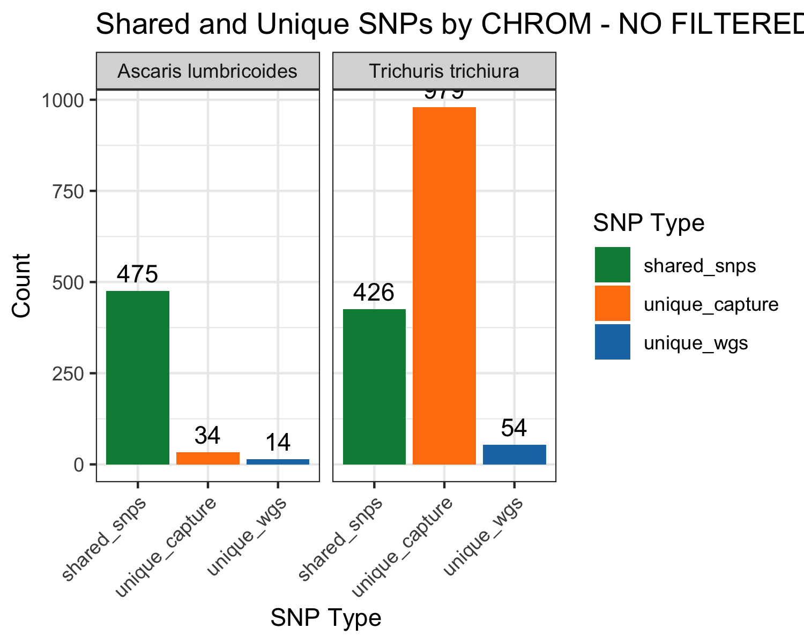
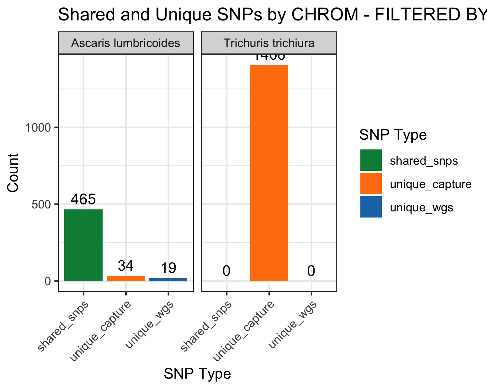
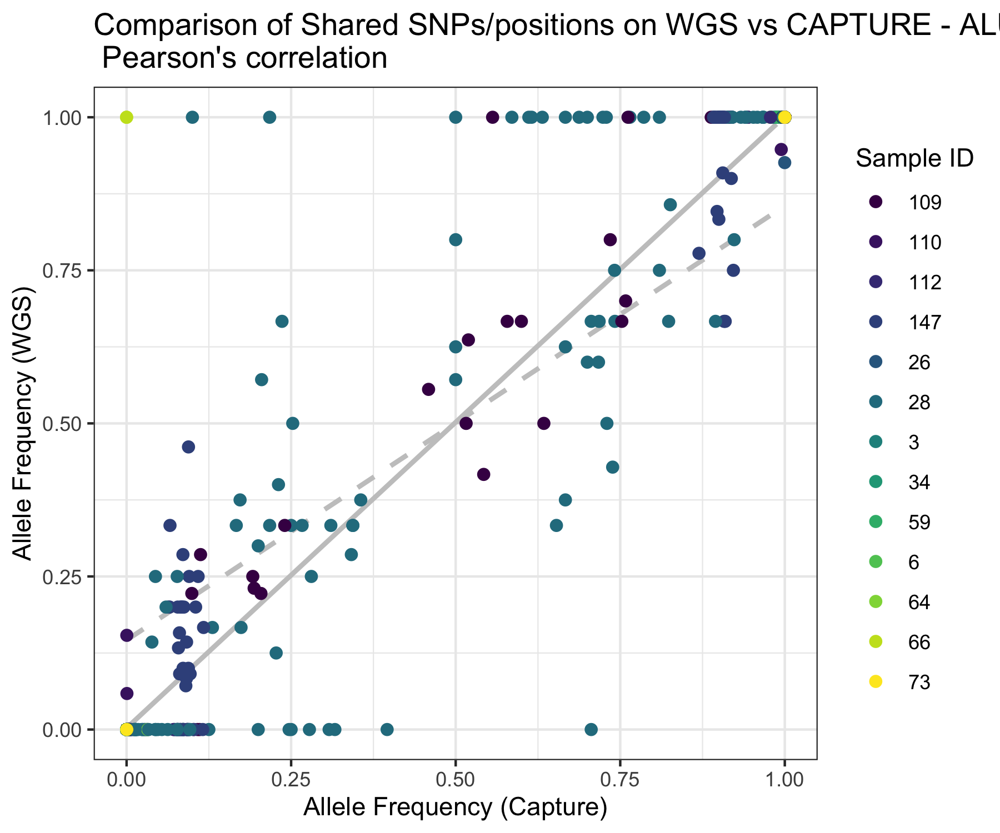

# Shared SNPs between hybrid capture and WGS datasets 

- Author: Marina Papaiakovou, mpapaiakovou[at]gmail.com 

# Contents
- Calculating shared SNPs between hybrid capture and WGS data 
  - before and after filtering by DP > 10 
- Calculating allele frequencies of shared SNPs for *Ascaris lumbricoides* only (*Trichuris* WGS does not work)

- We need the following datasets, after we have processed the VCFs with vcf2R
  - CAPTURE_ALL_NO_DEPTH_FILTER
  - SHOTGUN_ALL_NO_DEPTH_FILTER
  - Rerun the code here from previous script to get the variant datasets in R

```{r setup, warning = FALSE, message = FALSE}
library(vcfR)
library(tidyverse)
library(VariantAnnotation)
library(stringr)
library(patchwork)

#####################
### CAPTURE DATA ----
#####################

setwd("/Users/marinapapaiakovou/Documents/00.Cambridge_PhD/02.Science/05.Hybridization_probe/05.CAPTURE_DATA/02_TRIMMED_DATA/06_VARIANT_CALLING/01_MITOGENOME_VARS/01_WITH_ORPHAN_FLAG/")

#Ascaris 
ALUM_CAPTURE_all_mito_SNPs_bcftools <- read.vcfR ("ALUM_CAPTURE_DATA_ALL_SAMPLES_bcftools_with_orphan_reads_NOMINIMUMALLELEFREQ_NO_DEPTH_FILTER.recode.vcf")

ALUM_CAPTURE_all_mito_SNPs_bcftools <- vcfR2tidy(ALUM_CAPTURE_all_mito_SNPs_bcftools, single_frame = TRUE, toss_INFO_column = TRUE, alleles =TRUE)

ALUM_CAPTURE_all_mito_SNPs_bcftools_2 <- ALUM_CAPTURE_all_mito_SNPs_bcftools$dat

#will need to plot the QUALITY SCORES pper species
ALUM_CAPTURE_all_mito_SNPs_bcftools_3 <- ALUM_CAPTURE_all_mito_SNPs_bcftools_2 %>%
  dplyr::select(CHROM, POS, QUAL, REF, ALT,  DP4, Indiv)

ALUM_CAPTURE_all_mito_SNPs_bcftools_3$CHROM[ALUM_CAPTURE_all_mito_SNPs_bcftools_3$CHROM == 'NC_016198_Ascaris_lumbricoides_mitochondrion_complete_genome'] <- 'Ascaris lumbricoides'

#Trichuris 
TT_CAPTURE_all_mito_SNPs_bcftools <- read.vcfR ("TT_CAPTURE_DATA_ALL_SAMPLES_bcftools_with_orphan_reads_NOMINIMUMALLELEFREQ_NO_DEPTH_FILTER.recode.vcf")

TT_CAPTURE_all_mito_SNPs_bcftools <- vcfR2tidy(TT_CAPTURE_all_mito_SNPs_bcftools, single_frame = TRUE, toss_INFO_column = TRUE, alleles =TRUE)

TT_CAPTURE_all_mito_SNPs_bcftools_2 <- TT_CAPTURE_all_mito_SNPs_bcftools$dat

#will need to plot the QUALITY SCORES pper species
TT_CAPTURE_all_mito_SNPs_bcftools_3 <- TT_CAPTURE_all_mito_SNPs_bcftools_2 %>%
  dplyr::select(CHROM, POS, QUAL, REF, ALT,  DP4, Indiv)

TT_CAPTURE_all_mito_SNPs_bcftools_3$CHROM[TT_CAPTURE_all_mito_SNPs_bcftools_3$CHROM == 'NC_017750_Trichuris_trichiura_mitochondrion_complete_genome'] <- 'Trichuris trichiura'

CAPTURE_ALL_NO_DEPTH_FILTER <- rbind(ALUM_CAPTURE_all_mito_SNPs_bcftools_3, TT_CAPTURE_all_mito_SNPs_bcftools_3)


#####################
### WGS DATA ----
#####################


setwd("/Users/marinapapaiakovou/Documents/00.Cambridge_PhD/02.Science/05.Hybridization_probe/06.SHOTGUN_DATA/02_TRIMMED_DATA/06_VARIANT_CALLING/01_MITOGENOME_VARS/01_WITH_ORPHAN_FLAG/")

#Ascaris
ALUM_SHOTGUN_all_mito_SNPs_bcftools <- read.vcfR ("ALUM_SHOTGUN_DATA_ALL_SAMPLES_bcftools_with_orphan_reads_NOMINIMUMALLELEFREQ_NO_DEPTH_FILTER.recode.vcf")

ALUM_SHOTGUN_all_mito_SNPs_bcftools <- vcfR2tidy(ALUM_SHOTGUN_all_mito_SNPs_bcftools, single_frame = TRUE, toss_INFO_column = TRUE, alleles =TRUE)

ALUM_SHOTGUN_all_mito_SNPs_bcftools_2 <- ALUM_SHOTGUN_all_mito_SNPs_bcftools$dat

#will need to plot the QUALITY SCORES pper species
ALUM_SHOTGUN_all_mito_SNPs_bcftools_3 <- ALUM_SHOTGUN_all_mito_SNPs_bcftools_2 %>%
  dplyr::select(CHROM, POS, QUAL, REF, ALT,  DP4, Indiv)

ALUM_SHOTGUN_all_mito_SNPs_bcftools_3$CHROM[ALUM_SHOTGUN_all_mito_SNPs_bcftools_3$CHROM == 'NC_016198_Ascaris_lumbricoides_mitochondrion_complete_genome'] <- 'Ascaris lumbricoides'

#Trichuris
TT_SHOTGUN_all_mito_SNPs_bcftools <- read.vcfR ("TT_SHOTGUN_DATA_ALL_SAMPLES_bcftools_with_orphan_reads_NOMINIMUMALLELEFREQ_NO_DEPTH_FILTER.recode.vcf")

TT_SHOTGUN_all_mito_SNPs_bcftools <- vcfR2tidy(TT_SHOTGUN_all_mito_SNPs_bcftools, single_frame = TRUE, toss_INFO_column = TRUE, alleles =TRUE)

TT_SHOTGUN_all_mito_SNPs_bcftools_2 <- TT_SHOTGUN_all_mito_SNPs_bcftools$dat

#will need to plot the QUALITY SCORES pper species
TT_SHOTGUN_all_mito_SNPs_bcftools_3 <- TT_SHOTGUN_all_mito_SNPs_bcftools_2 %>%
  dplyr::select(CHROM, POS, QUAL, REF, ALT,  DP4, Indiv)

TT_SHOTGUN_all_mito_SNPs_bcftools_3$CHROM[TT_SHOTGUN_all_mito_SNPs_bcftools_3$CHROM == 'NC_017750_Trichuris_trichiura_mitochondrion_complete_genome'] <- 'Trichuris trichiura'


#COMBINE THE DATASETS TO COMPARE THEIR SNPS
SHOTGUN_ALL_NO_DEPTH_FILTER <- rbind(ALUM_SHOTGUN_all_mito_SNPs_bcftools_3, TT_SHOTGUN_all_mito_SNPs_bcftools_3)


```

### Finding shared and unique SNPs for hybrid capture and WGS, no DP filter has been applied!

```{r, warning=FALSE, message=FALSE}
dataset2<- SHOTGUN_ALL_NO_DEPTH_FILTER %>%
  mutate(
    Indiv = ifelse(grepl(".*_(\\d+)_trimmed", Indiv),              # Check if Indiv contains a number
                   sub(".*_(\\d+)_trimmed", "\\1", Indiv),         # Extract numeric sample ID
                   sub(".*_(Ascaris)_.*", "\\1", Indiv))           # Otherwise, extract species name
  )

dataset2$dataset<- "wgs"

dataset1 <- CAPTURE_ALL_NO_DEPTH_FILTER %>%
  mutate(
    Indiv = ifelse(grepl(".*_(\\d+)_trimmed", Indiv),              # Check if Indiv contains a number
                   sub(".*_(\\d+)_trimmed", "\\1", Indiv),         # Extract numeric sample ID
                   sub(".*_(Ascaris)_.*", "\\1", Indiv))           # Otherwise, extract species name
  )

dataset1$dataset<- "capture"


# Load necessary library
library(dplyr)

# Perform an inner join on CHROM, POS, and Indiv between dataset1 and dataset2
comparison <- dataset1 %>%
  inner_join(dataset2, by = c("CHROM", "POS", "Indiv"), suffix = c("_capture", "_wgs")) %>%
  
  # Step 2: Compare REF and ALT values between the two datasets
  mutate(
    ref_match = ifelse(REF_capture == REF_wgs, TRUE, FALSE),   # Check if REF matches
    alt_match = ifelse(ALT_capture == ALT_wgs, TRUE, FALSE),   # Check if ALT matches
    both_match = ifelse(ref_match & alt_match, TRUE, FALSE)    # Check if both REF and ALT match
  ) %>%
  
  # Select relevant columns for output
  dplyr::select(CHROM, POS, Indiv, REF_capture, ALT_capture, REF_wgs, ALT_wgs, ref_match, alt_match, both_match)

match_summary <- comparison %>%
  summarise(
    total_rows = n(),                          # Total number of comparisons
    ref_matches = sum(ref_match, na.rm = TRUE),  # Count of REF matches
    alt_matches = sum(alt_match, na.rm = TRUE),  # Count of ALT matches
    both_matches = sum(both_match, na.rm = TRUE) # Count of both REF and ALT matches
  )

unique_pos_summary <- comparison %>%
  group_by(CHROM, Indiv) %>%
  summarise(
    unique_pos_count = n_distinct(POS)  # Count the number of unique POS for each group
  )


#to find the unique positions in the dataset1 (capture) that do not exist in dataset 2 

# Load necessary library
library(dplyr)

# Step 1: Perform an anti-join to find POS in dataset1 that are not in dataset2
unique_snp_dataset1 <- dataset1 %>%
  anti_join(dataset2, by = c("CHROM", "POS", "Indiv")) %>%
  
  # Step 2: Count the number of unique POS per CHROM and Indiv
  group_by(CHROM, Indiv) %>%
  summarise(
    unique_snps = n_distinct(POS)  # Count the unique SNPs (POS) for each CHROM and Indiv
  )


###### PLOT THE SHARED SNPS
# Load necessary libraries
library(dplyr)
library(ggplot2)

# Assume comparison, dataset1, and dataset2 are already defined

# Load necessary libraries
library(dplyr)
library(ggplot2)
library(tidyr)  # For pivot_longer
library(viridis)  # For color palette

# Step 1: Count unique SNPs in the comparison dataset
shared_snps_summary <- comparison %>%
  group_by(CHROM) %>%
  summarise(
    shared_snps = n_distinct(POS[both_match]),  # Count unique POS where both match
    .groups = "drop"  # Avoids warning about grouped data
  )

# Step 2: Count unique SNPs in dataset1 that are not in dataset2
unique_capture_summary <- dataset1 %>%
  anti_join(dataset2, by = c("CHROM", "POS", "Indiv")) %>%
  group_by(CHROM) %>%
  summarise(
    unique_capture = n_distinct(POS),  # Count unique POS in dataset1 only
    .groups = "drop"
  )

# Step 3: Count unique SNPs in dataset2 that are not in dataset1
unique_wgs_summary <- dataset2 %>%
  anti_join(dataset1, by = c("CHROM", "POS", "Indiv")) %>%
  group_by(CHROM) %>%
  summarise(
    unique_wgs = n_distinct(POS),  # Count unique POS in dataset2 only
    .groups = "drop"
    
  )

#THE 4 VARIANTS THAT MAKE IT TO THE OTHER SIDE ARE: 4 VARIANTS IN THE NON CODING REGION 
#AND THE QUALITY WAS FROM 6 TO 16 TO 231, but if I had filtered for 10th  quantile of quality of Ascaris VARS
#they would hav ebeen filtered out
#WHAT POSITIONS: 7532, 7535, 7539, 7727

#WHAT POSITIONS ARE IN THE WGS DATASETS AND NOT IN THE PROBE
UNIQUE_WGS <- dataset2 %>%
  anti_join(dataset1, by = c("CHROM", "POS", "Indiv")) %>%
  group_by(CHROM) 


# Step 4: Combine the results into one data frame for plotting
plot_data <- shared_snps_summary %>%
     full_join(unique_capture_summary, by = "CHROM") %>%  # Use full_join to include all CHROMs
     full_join(unique_wgs_summary, by = "CHROM") %>%
     pivot_longer(cols = c(shared_snps, unique_capture, unique_wgs), 
                                   names_to = "SNP_Type", 
                                   values_to = "Count") %>%
     replace_na(list(Count = 0))  # Replace NA with 0 for missing values

#split by species 
#Ascaris
plot_data_Ascaris <- plot_data %>%
  filter(CHROM =="Ascaris lumbricoides")

```

- Plotting barplots with shared and unique SNPs for hybrid capture and WGS without DP filter

```{r SHARED_SNPs_CAPTURE_WGS_NO_FILTER, warning=FALSE,message= FALSE, fig.path='./00_FIGURES/'}

png(filename = "00_FIGURES/SHARED_SNPs_CAPTURE_WGS_NO_FILTER.png", height = 4, width = 5, units = "in", res = 300)

# Step 5: Create the bar plot with viridis colors and labels
#plot_data$SNP_Type <- factor(plot_data$SNP_Type, levels = c("unique_wgs", "unique_capture", "shared_snps"))

SHARED_SNPs_CAPTURE_WGS_NO_FILTER <- ggplot(plot_data, aes(x = SNP_Type, y = Count, fill = SNP_Type)) +
  geom_bar(stat = "identity", 
           position = position_dodge(width = 0.4), # Reduce dodge to bring bars closer
           width = 0.9) + #which is the default, if you want them to touch you change it 1
  geom_text(aes(label = Count), 
            position = position_dodge(width = 0.4),  # Match the dodge width
            vjust = -0.5) +        
  facet_grid(~ CHROM) +
 # scale_fill_viridis_d() +  # Use viridis color palette
  labs(title = "Shared and Unique SNPs by CHROM - NO FILTERED BY DEPTH",
       x = "SNP Type",
       y = "Count",
       fill = "SNP Type") +
  scale_fill_manual(values = c("unique_wgs" = "#1f77b4", "unique_capture" = "#ff7f0e", "shared_snps" = "springgreen4")) +  # Custom colors for points
  theme_bw() +
  theme(axis.text.x = element_text(angle = 45, hjust = 1))

print(SHARED_SNPs_CAPTURE_WGS_NO_FILTER)
dev.off()
```

- Beautify on illustrator! 

### Finding shared and unique SNPs for hybrid capture and WGS, AFTER DP filter has been applied!

- We need the following datasets, after we have processed the VCFs with vcf2R
  - CAPTURE_ALL_DEPTH_FILTERED 
  - SHOTGUN_ALL_DEPTH_FILTERED 
  - Rerun the code here from previous script to get the variant datasets in R


```{r, warning= FALSE, message=FALSE}
################################################
# CAPTURE AND SHOTGUN FILTERED DATA BY DP > 10 ----
################################################

##########################
### CAPTURE DATA ----
##########################

setwd("/Users/marinapapaiakovou/Documents/00.Cambridge_PhD/02.Science/05.Hybridization_probe/05.CAPTURE_DATA/02_TRIMMED_DATA/06_VARIANT_CALLING/01_MITOGENOME_VARS/01_WITH_ORPHAN_FLAG/")

#Ascaris
ALUM_CAPTURE_DEPTH_FILTERED_all_mito_SNPs_bcftools <- read.vcfR ("ALUM_CAPTURE_DATA_ALL_SAMPLES_bcftools_with_orphan_reads_NOMINIMUMALLELEFREQ_DP10_FILTER.recode.vcf")

ALUM_CAPTURE_DEPTH_FILTERED_all_mito_SNPs_bcftools <- vcfR2tidy(ALUM_CAPTURE_DEPTH_FILTERED_all_mito_SNPs_bcftools, single_frame = TRUE, toss_INFO_column = TRUE, alleles =TRUE)

ALUM_CAPTURE_DEPTH_FILTERED_all_mito_SNPs_bcftools_2 <- ALUM_CAPTURE_DEPTH_FILTERED_all_mito_SNPs_bcftools$dat

#will need to plot the QUALITY SCORES pper species
ALUM_CAPTURE_DEPTH_FILTERED_all_mito_SNPs_bcftools_3 <- ALUM_CAPTURE_DEPTH_FILTERED_all_mito_SNPs_bcftools_2 %>%
  dplyr::select(CHROM, POS, QUAL, REF, ALT,  DP4, Indiv)

ALUM_CAPTURE_DEPTH_FILTERED_all_mito_SNPs_bcftools_3$CHROM[ALUM_CAPTURE_DEPTH_FILTERED_all_mito_SNPs_bcftools_3$CHROM == 'NC_016198_Ascaris_lumbricoides_mitochondrion_complete_genome'] <- 'Ascaris lumbricoides'
#CAPTURE_DEPTH_FILTERED_all_mito_SNPs_bcftools_3$CHROM[CAPTURE_DEPTH_FILTERED_all_mito_SNPs_bcftools_3$CHROM == 'NC_017750_Trichuris_trichiura_mitochondrion_complete_genome'] <- 'Trichuris trichiura'

#Trichuris
TT_CAPTURE_DEPTH_FILTERED_all_mito_SNPs_bcftools <- read.vcfR ("TT_CAPTURE_DATA_ALL_SAMPLES_bcftools_with_orphan_reads_NOMINIMUMALLELEFREQ_DP10_FILTER.recode.vcf")

TT_CAPTURE_DEPTH_FILTERED_all_mito_SNPs_bcftools <- vcfR2tidy(TT_CAPTURE_DEPTH_FILTERED_all_mito_SNPs_bcftools, single_frame = TRUE, toss_INFO_column = TRUE, alleles =TRUE)

TT_CAPTURE_DEPTH_FILTERED_all_mito_SNPs_bcftools_2 <- TT_CAPTURE_DEPTH_FILTERED_all_mito_SNPs_bcftools$dat

#will need to plot the QUALITY SCORES pper species
TT_CAPTURE_DEPTH_FILTERED_all_mito_SNPs_bcftools_3 <- TT_CAPTURE_DEPTH_FILTERED_all_mito_SNPs_bcftools_2 %>%
  dplyr::select(CHROM, POS, QUAL, REF, ALT,  DP4, Indiv)

TT_CAPTURE_DEPTH_FILTERED_all_mito_SNPs_bcftools_3$CHROM[TT_CAPTURE_DEPTH_FILTERED_all_mito_SNPs_bcftools_3$CHROM == 'NC_017750_Trichuris_trichiura_mitochondrion_complete_genome'] <- 'Trichuris trichiura'


CAPTURE_ALL_DEPTH_FILTERED <- rbind(ALUM_CAPTURE_DEPTH_FILTERED_all_mito_SNPs_bcftools_3, TT_CAPTURE_DEPTH_FILTERED_all_mito_SNPs_bcftools_3)


##########################
### SHOTGUN/WGS DATA ----
##########################

setwd("/Users/marinapapaiakovou/Documents/00.Cambridge_PhD/02.Science/05.Hybridization_probe/06.SHOTGUN_DATA/02_TRIMMED_DATA/06_VARIANT_CALLING/01_MITOGENOME_VARS/01_WITH_ORPHAN_FLAG/")

#Ascaris
ALUM_SHOTGUN_DEPTH_FILTERED_all_mito_SNPs_bcftools <- read.vcfR ("ALUM_SHOTGUN_DATA_ALL_SAMPLES_bcftools_with_orphan_reads_NOMINIMUMALLELEFREQ_DP10_FILTER.recode.vcf")

ALUM_SHOTGUN_DEPTH_FILTERED_all_mito_SNPs_bcftools <- vcfR2tidy(ALUM_SHOTGUN_DEPTH_FILTERED_all_mito_SNPs_bcftools, single_frame = TRUE, toss_INFO_column = TRUE, alleles =TRUE)

ALUM_SHOTGUN_DEPTH_FILTERED_all_mito_SNPs_bcftools_2 <- ALUM_SHOTGUN_DEPTH_FILTERED_all_mito_SNPs_bcftools$dat

#will need to plot the QUALITY SCORES pper species
ALUM_SHOTGUN_DEPTH_FILTERED_all_mito_SNPs_bcftools_3 <- ALUM_SHOTGUN_DEPTH_FILTERED_all_mito_SNPs_bcftools_2 %>%
  dplyr::select(CHROM, POS, QUAL, REF, ALT,  DP4, Indiv)


ALUM_SHOTGUN_DEPTH_FILTERED_all_mito_SNPs_bcftools_3$CHROM[ALUM_SHOTGUN_DEPTH_FILTERED_all_mito_SNPs_bcftools_3$CHROM == 'NC_016198_Ascaris_lumbricoides_mitochondrion_complete_genome'] <- 'Ascaris lumbricoides'
#SHOTGUN_DEPTH_FILTERED_all_mito_SNPs_bcftools_3$CHROM[SHOTGUN_DEPTH_FILTERED_all_mito_SNPs_bcftools_3$CHROM == 'NC_017750_Trichuris_trichiura_mitochondrion_complete_genome'] <- 'Trichuris trichiura'

#Trichuris
TT_SHOTGUN_DEPTH_FILTERED_all_mito_SNPs_bcftools <- read.vcfR ("TT_SHOTGUN_DATA_ALL_SAMPLES_bcftools_with_orphan_reads_NOMINIMUMALLELEFREQ_DP10_FILTER.recode.vcf")

#not working because it's empty ....
#TT_SHOTGUN_DEPTH_FILTERED_all_mito_SNPs_bcftools <- vcfR2tidy(TT_SHOTGUN_DEPTH_FILTERED_all_mito_SNPs_bcftools, single_frame = TRUE, toss_INFO_column = TRUE, alleles =TRUE)

SHOTGUN_ALL_DEPTH_FILTERED <- ALUM_SHOTGUN_DEPTH_FILTERED_all_mito_SNPs_bcftools_3


```

### Finding shared and unique SNPs for hybrid capture and WGS, AFTER DP filter has been applied!


```{r, warning = FALSE, message=FALSE}
#SHARED SNPS BETWEEN 
dataset2<- SHOTGUN_ALL_DEPTH_FILTERED %>%
  mutate(
    Indiv = ifelse(grepl(".*_(\\d+)_trimmed", Indiv),              # Check if Indiv contains a number
                   sub(".*_(\\d+)_trimmed", "\\1", Indiv),         # Extract numeric sample ID
                   sub(".*_(Ascaris)_.*", "\\1", Indiv))           # Otherwise, extract species name
  )

dataset2$dataset<- "wgs"

dataset1 <- CAPTURE_ALL_DEPTH_FILTERED %>%
  mutate(
    Indiv = ifelse(grepl(".*_(\\d+)_trimmed", Indiv),              # Check if Indiv contains a number
                   sub(".*_(\\d+)_trimmed", "\\1", Indiv),         # Extract numeric sample ID
                   sub(".*_(Ascaris)_.*", "\\1", Indiv))           # Otherwise, extract species name
  )

dataset1$dataset<- "capture"


# Load necessary library
library(dplyr)

# Perform an inner join on CHROM, POS, and Indiv between dataset1 and dataset2
comparison <- dataset1 %>%
  inner_join(dataset2, by = c("CHROM", "POS", "Indiv"), suffix = c("_capture", "_wgs")) %>%
  
  # Step 2: Compare REF and ALT values between the two datasets
  mutate(
    ref_match = ifelse(REF_capture == REF_wgs, TRUE, FALSE),   # Check if REF matches
    alt_match = ifelse(ALT_capture == ALT_wgs, TRUE, FALSE),   # Check if ALT matches
    both_match = ifelse(ref_match & alt_match, TRUE, FALSE)    # Check if both REF and ALT match
  ) %>%
  
  # Select relevant columns for output
  dplyr::select(CHROM, POS, Indiv, REF_capture, ALT_capture, REF_wgs, ALT_wgs, ref_match, alt_match, both_match)

match_summary <- comparison %>%
  summarise(
    total_rows = n(),                          # Total number of comparisons
    ref_matches = sum(ref_match, na.rm = TRUE),  # Count of REF matches
    alt_matches = sum(alt_match, na.rm = TRUE),  # Count of ALT matches
    both_matches = sum(both_match, na.rm = TRUE) # Count of both REF and ALT matches
  )

unique_pos_summary <- comparison %>%
  group_by(CHROM, Indiv) %>%
  summarise(
    unique_pos_count = n_distinct(POS)  # Count the number of unique POS for each group
  )


#to find the unique positions in the dataset1 (capture) that do not exist in dataset 2 

# Load necessary library
library(dplyr)

# Step 1: Perform an anti-join to find POS in dataset1 that are not in dataset2
unique_snp_dataset1 <- dataset1 %>%
  anti_join(dataset2, by = c("CHROM", "POS", "Indiv")) %>%
  
  # Step 2: Count the number of unique POS per CHROM and Indiv
  group_by(CHROM, Indiv) %>%
  summarise(
    unique_snps = n_distinct(POS)  # Count the unique SNPs (POS) for each CHROM and Indiv
  )

# Step 1: Count unique SNPs in the comparison dataset
shared_snps_summary <- comparison %>%
  group_by(CHROM) %>%
  summarise(
    shared_snps = n_distinct(POS[both_match]),  # Count unique POS where both match
    .groups = "drop"  # Avoids warning about grouped data
  )

# Step 2: Count unique SNPs in dataset1 that are not in dataset2
unique_capture_summary <- dataset1 %>%
  anti_join(dataset2, by = c("CHROM", "POS", "Indiv")) %>%
  group_by(CHROM) %>%
  summarise(
    unique_capture = n_distinct(POS),  # Count unique POS in dataset1 only
    .groups = "drop"
  )

# Step 3: Count unique SNPs in dataset2 that are not in dataset1
unique_wgs_summary <- dataset2 %>%
  anti_join(dataset1, by = c("CHROM", "POS", "Indiv")) %>%
  group_by(CHROM) %>%
  summarise(
    unique_wgs = n_distinct(POS),  # Count unique POS in dataset2 only
    .groups = "drop"
    
  )


#WHAT POSITIONS ARE IN THE WGS DATASETS AND NOT IN THE PROBE
UNIQUE_WGS <- dataset2 %>%
  anti_join(dataset1, by = c("CHROM", "POS", "Indiv")) %>%
  group_by(CHROM) 

unique(UNIQUE_WGS$POS)
#19 
#567  2546  3128  4681  6596  6842  7680  7681  7684  7688  7690  7695  7710  7717  7722  7727  8493  9790
#13217
#HOW MANY OF THOSE ABOVE ARE WITHIN THE COORDINATES OF THE PROBE DESIGN??? 


# Step 4: Combine the results into one data frame for plotting
plot_data <- shared_snps_summary %>%
  full_join(unique_capture_summary, by = "CHROM") %>%  # Use full_join to include all CHROMs
  full_join(unique_wgs_summary, by = "CHROM") %>%
  pivot_longer(cols = c(shared_snps, unique_capture, unique_wgs), 
               names_to = "SNP_Type", 
               values_to = "Count") %>%
  replace_na(list(Count = 0))  # Replace NA with 0 for missing values

#split by species 
#Ascaris
plot_data_Ascaris <- plot_data %>%
  filter(CHROM =="Ascaris lumbricoides")

```

- Plotting barplots with shared and unique SNPs for hybrid capture and WGS after DP filter (DP>10)


```{r SHARED_SNPs_CAPTURE_WGS_YES_DP_FILTER, warning=FALSE,message= FALSE, fig.path='./00_FIGURES/'}

png(filename = "00_FIGURES/SHARED_SNPs_CAPTURE_WGS_YES_DP_FILTER.png", height = 4, width = 5, units = "in", res = 300)


SHARED_SNPs_CAPTURE_WGS_YES_DP_FILTER <- ggplot(plot_data, aes(x = SNP_Type, y = Count, fill = SNP_Type)) +
  geom_bar(stat = "identity", 
           position = position_dodge(width = 0.4), # Reduce dodge to bring bars closer
           width = 0.9) + #which is the default, if you want them to touch you change it 1
  geom_text(aes(label = Count), 
            position = position_dodge(width = 0.4),  # Match the dodge width
            vjust = -0.5) +        
   facet_wrap(~ CHROM) +
  #scale_fill_viridis_d() +  # Use viridis color palette
  labs(title = "Shared and Unique SNPs by CHROM - FILTERED BY DEPTH",
       x = "SNP Type",
       y = "Count",
       fill = "SNP Type") +
  scale_fill_manual(values = c("unique_wgs" = "#1f77b4", "unique_capture" = "#ff7f0e", "shared_snps" = "springgreen4")) +  # Custom colors for points
  theme_bw() +
  theme(axis.text.x = element_text(angle = 45, hjust = 1))


print(SHARED_SNPs_CAPTURE_WGS_YES_DP_FILTER)
dev.off()
```


- Beautify on Illustrator 

### Assess correlation between frequencies of shared SNPs for *Ascaris lumbricoides* 
- Decided to proceed with the DP > 10 VCFs to add some confidence on the data 
- Need to extract the FORMAT/AD columns from the VCFs to get the allele depth and calculate frequencies 

```bash 
#Export the FORMAT/AD from the VCF files that have already been filtered for DP > 10
#CAPTURE DATA
vcftools --vcf ALUM_CAPTURE_DATA_ALL_SAMPLES_bcftools_with_orphan_reads_NOMINIMUMALLELEFREQ_DP10_FILTER.recode.vcf --extract-FORMAT-info AD --out ALUM_CAPTURE_DATA_ALL_SAMPLES_bcftools_with_orphan_reads_NOMINIMUMALLELEFREQ_DP10_FILTER_FORMAT_AD
#After filtering, kept 499 out of a possible 499 Sites
vcftools --vcf TT_CAPTURE_DATA_ALL_SAMPLES_bcftools_with_orphan_reads_NOMINIMUMALLELEFREQ_DP10_FILTER.recode.vcf --extract-FORMAT-info AD --out TT_CAPTURE_DATA_ALL_SAMPLES_bcftools_with_orphan_reads_NOMINIMUMALLELEFREQ_DP10_FILTER_FORMAT_AD
#After filtering, kept 1406 out of a possible 1406 Sites

#SHOTGUN DATA
vcftools --vcf ALUM_SHOTGUN_DATA_ALL_SAMPLES_bcftools_with_orphan_reads_NOMINIMUMALLELEFREQ_DP10_FILTER.recode.vcf --extract-FORMAT-info AD --out ALUM_SHOTGUN_DATA_ALL_SAMPLES_bcftools_with_orphan_reads_NOMINIMUMALLELEFREQ_DP10_FILTER_FORMAT_AD
#After filtering, kept 484 out of a possible 484 Sites

vcftools --vcf TT_SHOTGUN_DATA_ALL_SAMPLES_bcftools_with_orphan_reads_NOMINIMUMALLELEFREQ_DP10_FILTER.recode.vcf --extract-FORMAT-info AD --out TT_SHOTGUN_DATA_ALL_SAMPLES_bcftools_with_orphan_reads_NOMINIMUMALLELEFREQ_DP10_FILTER_FORMAT_AD
#After filtering, kept 0 out of a possible 0 Sites

```
- Import in R and remove the *Ascaris* worm data because this will skew all the results
- Keep only the faecal data for both hybrid capture and for WGS

```{r, warning=FALSE, message=FALSE}
GENERATE_ALLELE_FREQS <- function(file) {
  df_1 <- read.delim(file, header=T, sep="\t")
  # Perform data cleaning and calculations of allele frequency
  df_out <- pivot_longer(df_1, cols = 3:ncol(df_1),
                         names_to = "sample.id",
                         values_to = "allele_depth")
  df_2<- separate(data = df_out, col = allele_depth, into = c("REF_depth", "ALT_depth"), sep = ",")
  df_2[, 4:5] <- lapply(df_2[, 4:5], as.numeric)
  df_3 <- mutate(df_2, SUM_DEPTH = rowSums(df_2[, 4:5], na.rm = TRUE))
  df_4 <- df_3 %>% group_by(CHROM) %>% mutate(allele_frequency = ALT_depth / SUM_DEPTH)
  df_clean <- df_4 %>% filter(!is.nan(allele_frequency))
  
  return(df_clean)
}

#CAPTURE DATA
setwd("/Users/marinapapaiakovou/Documents/00.Cambridge_PhD/02.Science/05.Hybridization_probe/05.CAPTURE_DATA/02_TRIMMED_DATA/06_VARIANT_CALLING/02_FORMAT_AD_FILES/")

#call the function
#Ascaris
ALUM_CAPTURE_DATA_ALLELE_FREQ <- GENERATE_ALLELE_FREQS("ALUM_CAPTURE_DATA_ALL_SAMPLES_bcftools_with_orphan_reads_NOMINIMUMALLELEFREQ_DP10_FILTER_FORMAT_AD.AD.FORMAT")
ALUM_CAPTURE_DATA_ALLELE_FREQ$dataset <- "capture"

#replace the sample ids
ALUM_CAPTURE_DATA_ALLELE_FREQ <- ALUM_CAPTURE_DATA_ALLELE_FREQ %>%
  mutate(sample.id = sub("CAP_(\\d+)_trimmed", "\\1", sample.id))

#remove the ascaris worm because it will skew the correlations
ALUM_CAPTURE_DATA_ALLELE_FREQ_NO_WORM <- ALUM_CAPTURE_DATA_ALLELE_FREQ %>%
  filter(sample.id!='CAP_Ascaris_pos_NHM10_trimmed')


#SHOTGUN DATA
setwd("/Users/marinapapaiakovou/Documents/00.Cambridge_PhD/02.Science/05.Hybridization_probe/06.SHOTGUN_DATA/02_TRIMMED_DATA/06_VARIANT_CALLING/02_FORMAT_AD_FILES/")

#call the function
ALUM_SHOTGUN_DATA_ALLELE_FREQ <- GENERATE_ALLELE_FREQS("ALUM_SHOTGUN_DATA_ALL_SAMPLES_bcftools_with_orphan_reads_NOMINIMUMALLELEFREQ_DP10_FILTER_FORMAT_AD.AD.FORMAT")
ALUM_SHOTGUN_DATA_ALLELE_FREQ$dataset <- "wgs"


#replace the sample ids
ALUM_SHOTGUN_DATA_ALLELE_FREQ <- ALUM_SHOTGUN_DATA_ALLELE_FREQ %>%
  mutate(sample.id = sub("SHOTGUN_(\\d+)_trimmed", "\\1", sample.id))

#remove the ascaris worm because it will skew the correlations
ALUM_SHOTGUN_DATA_ALLELE_FREQ_NO_WORM <- ALUM_SHOTGUN_DATA_ALLELE_FREQ %>%
  filter(sample.id!='SHOTGUN_Ascaris_pos_NHM10_trimmed')

```

- Generate list of POS to find matching SNPs and keep only those

```{r, warning=FALSE, message=FALSE}
#generate a list of POS in the wgs data and keep only the rows for which the POS in the capture data are part of the list
ALUM_wgs_pos_list <- unique(ALUM_SHOTGUN_DATA_ALLELE_FREQ_NO_WORM$POS)
#478 SNPs

#Filter now the CAPTURE data based on these positions in the wgs_list
ALUM_CAPTURE_DATA_ALLELE_FREQ_NO_WORM_FILTERED <- ALUM_CAPTURE_DATA_ALLELE_FREQ_NO_WORM %>% filter(POS %in% ALUM_wgs_pos_list)

ALUM_CAPTURE_DATA_ALLELE_FREQ_NO_WORM_FILTERED_2 <- ALUM_CAPTURE_DATA_ALLELE_FREQ_NO_WORM_FILTERED %>%
  dplyr::select(1, 2, 3, 7, 8)


#generate a unique list of positions from the CAPTURE data 
ALUM_capture_pos_list <- unique(ALUM_CAPTURE_DATA_ALLELE_FREQ_NO_WORM$POS)
#498

#now filter the SHOTGUN but the CAPTURE list to keep them even 
ALUM_SHOTGUN_DATA_ALLELE_FREQ_NO_WORM_FILTERED <- ALUM_SHOTGUN_DATA_ALLELE_FREQ_NO_WORM %>% filter(POS %in% ALUM_capture_pos_list) 

ALUM_SHOTGUN_DATA_ALLELE_FREQ_NO_WORM_FILTERED_2 <- ALUM_SHOTGUN_DATA_ALLELE_FREQ_NO_WORM_FILTERED %>%
  dplyr::select(1, 2, 3, 7, 8)

#combine the datasets 
# Perform an inner join to keep only matching rows
# Perform the inner join to keep matching CHROM, POS, and sample.id
ALUM_SHARED_SNPs <- ALUM_CAPTURE_DATA_ALLELE_FREQ_NO_WORM_FILTERED_2 %>%
  inner_join(ALUM_SHOTGUN_DATA_ALLELE_FREQ_NO_WORM_FILTERED_2, 
             by = c("CHROM", "POS", "sample.id")) %>%
  dplyr::select(CHROM, POS, sample.id, 
         allele_frequency_capture = allele_frequency.x, 
         dataset_capture = dataset.x,
         allele_frequency_wgs = allele_frequency.y, 
         dataset_wgs = dataset.y)


# Calculate Pearson correlation
correlation <- cor(ALUM_SHARED_SNPs$allele_frequency_capture, ALUM_SHARED_SNPs$allele_frequency_wgs, method = "pearson")

cor.test(ALUM_SHARED_SNPs$allele_frequency_capture, 
         ALUM_SHARED_SNPs$allele_frequency_wgs, 
         method = "pearson", 
         conf.level = 0.99) 


#correlation whe I remove 0s and 1s because this is what drives it the most 
#The correlation I get without the 0s and the 1s is still high = 
ALUM_SHARED_SNPs_NO_ZERO_NO_ONE <- ALUM_SHARED_SNPs %>%
  filter(allele_frequency_capture >0 & allele_frequency_wgs >0) %>%
  filter(allele_frequency_capture <1 & allele_frequency_wgs <1 )
#
#> correlation with 4517 observations
#[1] 0.9960135
#> correlation_NO_ZERO_NO_ONE, after removing 0s and 1s
#[1] 0.9001772

#These are numbers needed for the paper 
POS_NO_FLTER <- unique(ALUM_SHARED_SNPs$POS)
SAMPLES_NO_FILTER <- unique(ALUM_SHARED_SNPs$sample.id)
#13 individuals, 

unique(ALUM_SHARED_SNPs_NO_ZERO_NO_ONE$POS)
#55 SNPs
unique(ALUM_SHARED_SNPs_NO_ZERO_NO_ONE$sample.id)
#5 individuals

correlation_NO_ZERO_NO_ONE <- cor(ALUM_SHARED_SNPs_NO_ZERO_NO_ONE$allele_frequency_capture, ALUM_SHARED_SNPs_NO_ZERO_NO_ONE$allele_frequency_wgs, method = "pearson")

# Format the correlation text
correlation_text <- paste("Pearson's correlation:", round(correlation, 3))

```
### Plotting Pearson's correlation of allele frequencies of shared SNPs for *Ascaris* positive faecal data

```{r ALLELE_FREQs_SHARED_SNPs_FAECAL_DATA_ASCARIS, warning=FALSE,message= FALSE, fig.path='./00_FIGURES/'}

png(filename = "00_FIGURES/ALLELE_FREQs_SHARED_SNPs_FAECAL_DATA_ASCARIS.png", height = 5, width = 6, units = "in", res = 300)

ALLELE_FREQs_SHARED_SNPs_FAECAL_DATA_ASCARIS <- ggplot(ALUM_SHARED_SNPs, aes(x = allele_frequency_capture, 
                             y = allele_frequency_wgs, 
                             color = factor(sample.id))) +  
  geom_smooth(method = "lm", se = FALSE, color = "gray78", linetype = "solid") +  # Line for the original dataset
  geom_smooth(data = ALUM_SHARED_SNPs_NO_ZERO_NO_ONE,  # Add the second dataset
              aes(x = allele_frequency_capture, y = allele_frequency_wgs),
              method = "lm", se = FALSE, color = "gray78", linetype = "dashed") +  # Line for the filtered dataset
    geom_point(size = 2) +  # Points for the original dataset
  scale_color_viridis_d() +  # Viridis color palette for points
  labs(x = "Allele Frequency (Capture)", 
       y = "Allele Frequency (WGS)", 
       color = "Sample ID") +  # Axis and legend labels
  theme_bw() +  # Clean theme
  theme(legend.position = "right") +  # Adjust legend position
  xlim(0, 1) + ylim(0, 1) +  # Axis limits
  ggtitle("Comparison of Shared SNPs/positions on WGS vs CAPTURE - ALUM \n Pearson's correlation")


print(ALLELE_FREQs_SHARED_SNPs_FAECAL_DATA_ASCARIS)
dev.off()
```


- Beautify and combine the above Illustrator !!! 
- I added the correlations on the plot on Illustrator
- Solid grey line includes all frequencies, no filtering 
- Dashed grey line has all the POS after I have excluded frequencies of 0s and 1s (which are the most of the datapoints)
```